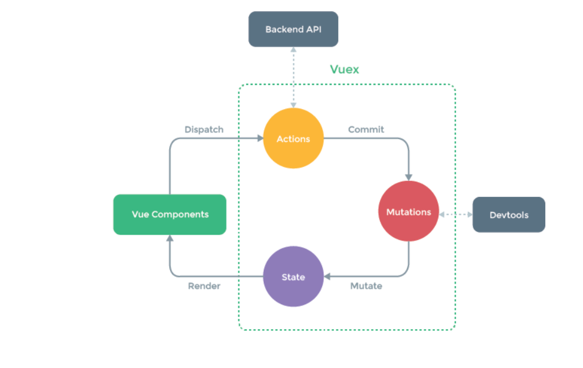

# 																																																																							[ Vue核心 ] 

## 初识 Vue

- 英文官网: https://vuejs.org/
- 中文官网: https://cn.vuejs.org/

1. 动态构建用户界面的渐进式 JavaScript 框架 
2.  作者:  尤雨溪

<font color='#DA924A'>Vue 的特点</font>

1. 采用组件化模式，提高代码复用率、代码更好的维护。
2. 编码简洁, 体积小, 运行效率高, 适合移动/PC 端开发。
3. 声明式编码，让编码人员无序直接操作DOM，提高开发效率
4. 使用虚拟 DOM + 优秀的 Diff 算法，尽量复用 DOM 节点。
5. 它本身只关注 UI, 也可以引入其它第三方库开发项。

<font color='#DA924A'>与其它 JS 框架的关联</font>

1. 借鉴 Angular 的模板和数据绑定技术 。
2.  借鉴 React 的组件化和虚拟 DOM 技。

<font color='#DA924A'>Vue 周边库</font>

1. vue-cli: vue 脚手架 
2. vue-resource 
3.  axios 
4. vue-router: 路由 
5.  vuex: 状态管理 
6. element-ui: 基于 vue 的 UI 组件库(PC 端）

...

----

## 安装

[<font color='cornflowerblue'>开发版本</font>](https://cn.vuejs.org/js/vue.js)包含完整的警告和调试模式

[<font color='cornflowerblue'>生产版</font>本](https://cn.vuejs.org/js/vue.min.js)删除了警告，33.46KB min+gzip

## [<font color='cornflowerblue'>CDN</font>](https://cn.vuejs.org/v2/guide/installation.html#CDN)

对于制作原型或学习，你可以这样使用最新版本：

```html
<script src="https://cdn.jsdelivr.net/npm/vue@2.6.14/dist/vue.js"></script>
```

对于生产环境，我们推荐链接到一个明确的版本号和构建文件，以避免新版本造成的不可预期的破坏：

```html
<script src="https://cdn.jsdelivr.net/npm/vue@2.6.14"></script>
```

如果你使用原生 ES Modules，这里也有一个兼容 ES Module 的构建文件：

```html
<script type="module">
  import Vue from 'https://cdn.jsdelivr.net/npm/vue@2.6.14/dist/vue.esm.browser.js'
</script>
```

你可以在 [<font color='cornflowerblue'>cdn.jsdelivr.net/npm/vue</font>](https://cdn.jsdelivr.net/npm/vue/) 浏览 NPM 包的源代码。

Vue 也可以在 [<font color='cornflowerblue'>unpkg</font>](https://unpkg.com/vue@2.6.14/dist/vue.js) 和 [<font color='cornflowerblue'>cdnjs</font>](https://cdnjs.cloudflare.com/ajax/libs/vue/2.6.14/vue.js) 上获取 (cdnjs 的版本更新可能略滞后)。

请确认了解[<font color='cornflowerblue'>不同构建版本</font>](https://cn.vuejs.org/v2/guide/installation.html#对不同构建版本的解释)并在你发布的站点中使用**生产环境版本**，把 `vue.js` 换成 `vue.min.js`。这是一个更小的构建，可以带来比开发环境下更快的速度体验。

## [<font color='cornflowerblue'>NPM</font>](https://cn.vuejs.org/v2/guide/installation.html#NPM)

在用 Vue 构建大型应用时推荐使用 NPM 安装[[<font color='cornflowerblue'>1</font>]](https://cn.vuejs.org/v2/guide/installation.html#footnote-1)。NPM 能很好地和诸如 [<font color='cornflowerblue'>webpack</font>](https://webpack.js.org/) 或 [<font color='cornflowerblue'>Browserify</font>](http://browserify.org/) 模块打包器配合使用。同时 Vue 也提供配套工具来开发[<font color='cornflowerblue'>单文件组件</font>](https://cn.vuejs.org/v2/guide/single-file-components.html)。

```c
# 最新稳定版
$ npm install vue
```


---

## 初始化

```js
<!DOCTYPE html>
<html lang="en">

<head>
    <meta charset="UTF-8">
    <meta http-equiv="X-UA-Compatible" content="IE=edge">
    <meta name="viewport" content="width=device-width, initial-scale=1.0">
    <title>Document</title>
    <script src="../js/vue.js"></script>
</head>

<body>
    <script>
        //在浏览器上下载  Vue Devtools。它允许你在一个更友好的界面中审查和调试 Vue 应用。
        Vue.config.productionTip = false; //以阻止 vue 在启动时生成生产提示。
       //也可以引用vue.min.js 可以避免
        
    </script>
</body>

</html>
```

##  基本使用

1. 初始化。
2. 创建一个 Vue实例。
3. 指定容器
4. 设置 数据

 ```html
 <head>  
 	<script src="../js/vue.js"></script>
 </head>
 
 <body>
     <!-- 添加一个容器 -->
     <div id="root">
         <!--
 			会报错找不到页签图标  
                 GET http://127.0.0.1:5500/favicon.ico 404 (Not Found)
                 进入请求 按住 shift + 刷新
               强制刷新可查看  可加入一个页签图标到根目录下
 		-->
         <h1>Hello {{name}}</h1> {{ 插值 }}
         <h1>Age {{age}}</h1>
      <!--  
      两个一样的容器只执行第一个
      只能使用一个 Vue 实例对一个盒子
      一对一
     <div class="root">
         <h1>Hello {{name}}</h1>
         <h1>Age {{age}}</h1>
     </div> 
     -->
     </div>
     <script>
         Vue.config.productionTip = false;
 
         //创建 Vue 实例
         new Vue({
             el: '#root', //el 用于指定当前 Vue 实例对哪个容器进行操作，值通常为 css 字符串。
             data: {      //data 中储存的数据供 el 指定的容器使用，值暂时使用一个对象。
                 name: 'Vue',
                 age: 18,
             },
         });
 
     </script>
 </body>
 ```

 

---

## 模板语法

Vue模板语法有2大类:

<font color='#DA924A'>1.</font><font color='#DA924A'>插值语法</font>:

功能:用于解析标签体内容。
写法:{{xx}},xxx是js表达式，且可以直接读取到data中的所有属性。


<font color='#DA924A'>2.</font><font color='#DA924A'>指令语法</font>:

功能:用于解析标签(包括:标签属性、标签体内容、绑定事件.....)。
举例: v-bind:href="xxx" 或简写为 :href="xxx", xxx同样要写js表达式，
且可以直接读取到data中的所有属性。

<font color='#DA924A'>备注</font>: Vue中有很多的指令，且形式都是: v-????, 此处我们只是拿v-bind举个例子。

```html
 <div id="root">
        <h1>插值语法</h1>
        <h3>Hello {{name}}</h3>
        <hr />
        <h1>指令语法</h1>
        <!-- v-bind:  简写 : -->
        <a v-bind:href="url">点我去学习1</a>
        <a :href="url">点我去学习2</a>
    </div>


    <script>
        Vue.config.productionTip = false;
        new Vue({
            el: '#root',
            data: {
                name: 'Vue',
                url: "https://cn.vuejs.org/index.html"
            }
        })
    </script>
```

---

## 数据绑定

- ### 单向数据绑定

> 1. 语法：v-bind:href ="xxx" 或简写为 :href 。
> 2. 特点：数据只能从 data 流向页面。


- ### 双向数据绑定

> 1. 语法：v-mode:value="xxx" 或简写为 v-model="xxx" 。
> 2. 特点：数据不仅能从 data 流向页面，还能从页面流向data。

```js
<body>
    <div id="root">
        单向数据绑定 <input type="text" v-bind:value="name">
        双向数据绑定 <input type="text" v-model:value="name">
            <!-- v-model 只能应用在表单类元素上-->
            <!-- 简写 <input type="text" v-model="name"> -->
    </div>


</body>
<script>
    Vue.config.productionTip = false;
    new Vue({
        el: '#root',
        data: {
            name: '鸡叽叽叽ji哥'
        }

    })
```

---

## el和data两种写法

```html
<body>
    <div id="root">
        <h1>{{name}}</h1>
    </div>


    <script>
        Vue.config.productionTip = false;
        const vue = new Vue({
            // el: "#root",
            // data: {
            //     name: 'ji'
            // }
            //data第二种写法  
            data: function () {
                console.log(this);
                return { //必需返回对象 不能使用箭头函数 可以简写不写function
                    name: "ji"
                }
            }
        });
        // 第二种绑定盒子
        vue.$mount('#root')
    </script>
</body>
```


---

## MVVM 模型

> 1. M：模型(Model) ：对应 data 中的数据 
> 2. V：视图(View) ：模板 
> 3. VM：视图模型(ViewModel) ： Vue 实例对象

通过 VM 将数据和页面链接

---


## 数据代理

通过一个对象代理对另一个对象中的属性操作  （读 / 写）

```html

    <script>
        let number = '男';
        let person = {
            name: 'w',
            age: '18'
        };
        // ES5 新增方法 
        // 参数 1. 给哪个对象添加参数  2. 属性名 3. 配置项
        Object.defineProperty(person, 'sex', {
            // value: 18
            // writable: false,//不允许重写这个值默认false      true 允许修改
            // enumerable: false,   //不允许遍历出来  默认是false
            // configurable: false, //默认false  不允许被删除  不允许再次修改特性false true
            //当有人读取 person sex 属性时 get函数(getter)被调用,返回sex值
            get() {
                return number;
            },    //当有人修改 person sex 属性时 set函数(setter)被调用,会收到修改的具体值
            set(value) {
                console.log('有人修改了sex为' + value);
                number = value;
            }
        });
        console.log(person);
```


```html
<div id="root">
        <h1>学校{{name}}</h1>
        <h1>地址{{address}}</h1>
    </div>


    <script>
        Vue.config.productionTip = false;
        let data = {
            name: '鸡1',
            address: '篮球2'
        }
        const vm = new Vue({
            el: "#root",
            data
        })              //options.data 传入的 data
        //vm._data === options.data === data
        console.log(vm);
    </script>
```

1. Vue中的数据代理:
   通过vm对象来代理data对象中属性的操作(读/写)

2. Vue中数据代理的好处:
更加方便的操作data中的数据
2. 基本原理:
通过0bject . defineProperty( )把data对象中所有属性添加到vm上。
为每个添加到vm 上的属性，都指定一个getter/setter.
在getter/setter内部去操作(读/写) data中对应的属性。


---

## 事件处理

### 1.绑定监听

> 1. v-on:xxx="fun"
> 2.  @xxx="fun" 
> 3.  @xxx="fun(参数)" 
> 4.  默认事件形参: event 
> 5. 隐含属性对象: $event2


```html
<div id="root">
        <!-- 事件的基本使用:
        1.使用v-on:xxx或@xx绑定事件，其中xxx是 事件名; 
        2.事件的回调需要配置在methods对象中，最终会在vm.上;
        3. methods中配置的函数，不要用箭头函数!否则this就不是vm了;
        4. methods中配置的函数，都是被Vue所管理的函数，this的指向是vm或组件实例对象;
        5. @click="demo"和@click=" demo($event)"效果一致， 但后者可以传参; -->

        <h1>{{name}}</h1>
        <button v-on:click="showInfo1">点击提示信息</button>
        <!-- 简写 -->
        <button @click="showInfo2(66,$event)">点击提示信息</button>
        <!--showInfo2(66,$event) 传递参数   $event 占位防止event方法丢失 不占为无法使用event方法- ->
        <!-- 点击后调用 showInfo 函数 -->
    </div>


    <script>
        Vue.config.productionTip = false;
        new Vue({
            el: "#root",
            data: {
                name: 'ji'
            },
            methods: {
                showInfo1(event) {  //event事件对象
                    console.log(event.target);    //输出发生事件的事件目标<button>点击提示信息</button> 
                    console.log(event.target.innerText);// 输出点击提示信息
                    console.log(this);   //指向 Vue 实例对象 vm
                    alert('提示信息')
                },
                showInfo2(number, event) {   //参数从事件目标内传递
                    console.log(number);
                    console.log(event.target);
                }
            }
        })

    </script>
```


```html
<h1 id="h1">
    {{fullName()}}   //函数事件插入时要加 小括号()
</h1>
<script>
	new Vue ({
        el:'#h1',
        methods: {
            return 'lalala'
        }
    })
</script>
```


### 2. 事件修饰

> 1.   **.prevent** : 阻止事件的默认行为 event.preventDefault() 。（常用）
> 2.   **.stop** : 停止事件冒泡 event.stopPropagation()。（常用）
> 3.  **.once**: 事件只触发一次。（常用）
> 4.  **.capture**：使用事件的捕获模式。
> 5.  **.self**: 只有 event.target 是当前操作的元素时才触发事件。
> 6.  **.passive**: 事件的默认行为立即执行，无需等待事件回调执行完毕。

```html
<!DOCTYPE html>
<html lang="en">

<head>
    <meta charset="UTF-8">
    <meta http-equiv="X-UA-Compatible" content="IE=edge">
    <meta name="viewport" content="width=device-width, initial-scale=1.0">
    <title>Document</title>
    <script src="../js/vue.js"></script>
    <style>
        * {
            margin-top: 50px;
        }

        div.div {
            width: 100px;
            height: 100px;
            background-color: red;
        }

        .div1 {
            padding: 5px;
            width: 100px;
            height: 100px;
            background-color: pink;
        }

        .div2 {
            margin: 5px;
            width: 50px;
            height: 50px;
            background-color: rgb(60, 23, 224);
        }

        .list {
            width: 200px;
            height: 200px;
            background-color: peru;
            overflow: auto;
        }
    </style>
</head>

<body>
    <div id="root">
        <h1>{{name}}</h1>
        <a href="https://baidu.com" @click.prevent="showInfo1">点击提示信息</a>
        <!-- 事件修饰符 .prevent  event.preventDefault()  阻止默认行为 -->


        <div class="div" @click="showInfo1">
            <!-- .stop    event.stopPropagation() 停止事件冒泡 -->
            <button @click.stop="showInfo1">点我提示信息</button>

        </div>


        <!-- .once: 事件只触发一次 -->
        <button @click.once="showInfo1">点我提示信息</button>


        <!-- 事件触发是先 捕获 在冒泡 触发事件 -->
        <!-- 捕获 先捕获最外层 在冒泡 在触发事件 -->
        <!-- 捕获由外向内 冒泡由内向外 -->
        <!-- .capture：使用事件的捕获模式触发事件。 -->
        <div class="div1" @click.capture="showMsg(0)">
            div1
            <div class="div2" @click="showMsg(1)">div2</div>
        </div>


        <!-- .self： 只有 event.target 是当前操作的元素时才触发事件。 -->
        <div class="div" @click.self="showInfo2">
            <!-- div 不是event.target 所以 点击 button 时不会触发 div -->
            <button @click="showInfo2">点我提示信息</button>

        </div>


        <!-- .passive: 事件的默认行为立即执行，无需等待事件回调执行完毕。 -->
        <ul class="list" @scroll.passive="demo">
            <!-- scroll滚动条滚动事件 
                wheel 滚动轮事件
            -->
            <li>1</li>
            <li>2</li>
            <li>3</li>
            <li>4</li>
        </ul>
    </div>


    <script>
        Vue.config.productionTip = false;
        new Vue({
            el: "#root",
            data: {
                name: 'ww'
            },
            methods: {
                showInfo1(e) {
                    // e.preventDefault()//阻止默认行为 阻止跳转  可以在事件对象里添加
                    alert('弹框')
                },
                showMsg(msg) {
                    console.log(msg);
                },
                showInfo2(event) {
                    console.log(event.target);
                },
                demo() {
                    for (let i = 0; i < 100000; i++) {
                        console.log('@');

                    }
                    console.log('事件结束滚动条运动');
                }
            }
        })

    </script>
</body>

</html>
```


### 3按键修饰符

> 1. keycode : 操作的是某个 keycode 值的键 
> 2.  .keyName : 操作的某个按键名的键(少部分)

```html
    <!--
         回车=> enter

        删除=> delete ( 捕获“删除”和“退格”键)

        退出=> esc

        空格=> space

        换行=> tab 要使用 keydown

        上=>up

        下=> down

        左=> left

        右=> right

        Vue未提供别名的按键，可以使用按键原始的key值去绑定，但注意要转为 caps-lock (短横线命名)

        系统修饰键(用法特殊) : ctrl、 alt、shift、 meta

        ​ (1).配合keyup使用:按下修饰键的同时，再按下其他键，随后释放其他键，事件才被触发。
			@keyup.ctrl.y  只能按下 ctrl+y才会触发事件
        ​ (2).配合keydown使用:正常触发事件。
			也可以使用keyCode去指定具体的按键(不推荐)，
			Vue. config. keyCodes.自定义键名=键码，可以去定制按键别名 
    -->

<div id="root">
        <h1>{{name}}</h1>
        <input type="text" placeholder="按下回车提示输入" @keyup.enter="showInfo">  
  </div>


    <script>
        Vue.config.productionTip = false;
        new Vue({
            el: "#root",
            data: {
                name: 'ww'
            },
            methods: {
                showInfo(e) {

                    // if (e.keyCode !== 13) return   //按键编码  回车 = 13 
                    //还可以在事件对象里设置判断
                    console.log(e.target.value)
                }
            }
        })

    </script>
```


   

---


## 计算属性与监视

### 计算属性-computed

> 1. 要显示的数据不存在，要通过计算得来。 
>
> 2. 在 computed 对象中定义计算属性。
>
> 3. 在页面中使用{{方法名}}来显示计算的结果。
>    1.定义:要用的属性不存在，要通过已有属性计算得来。
>    2.原理:底层借助了0bjcet . defineproperty方法提供的getter和setter.get函数什么时候执行?
>    (1).初次读取时会执行一次。
>    (2).当依赖的数据发生改变时会被再次调用。
>
> 4. 优势:与methods 实现相比，内部有缓存机制(复用)，效率更高，调试方便。
>
>    
>
>    备注:
>    1.计算属性最终会出现在vm上，直接读取使用即可。
>    2.如果计算属性要被修改，那必须写set函数去响应修改，且set中要引起计算时依赖的数据发生改变。

 ```html
     <div id="root">
         姓：<input type="text" v-model="firstName"> <br>
         名：<input type="text" v-model="lastName"> <br>
         姓名: <span>{{fullName}}</span><br>
         姓名: <span>{{fullName}}</span><br>
         姓名: <span>{{fullName}}</span> <br>
         <!-- get只调用一次 缓存下来了 -->
     </div>
 
     <script>
         Vue.config.productionTip = false;
         const vm = new Vue({
             el: "#root",
             data: {
                 firstName: 'w',
                 lastName: 'zk'
             },
             computed: { //计算属性
                 fullName: {
                     /*
                     有人读取 get 返回fullName 的值
                     get 什么时候调用 
                     1. 初次读取 fullName时调用 然后缓存下来。
                     2. 所依赖的数据  firstName lastName 发生变化时。
                     */
                     get() {
                         return this.firstName + '-' + this.lastName
                     },//fullName 被修改时调用 set
                     set(value) {
                         console.log('set' + value)
                         const arr = value.split('-')
                         this.firstName = arr[0]
                         this.lastName = arr[1]
                     }
                 }
             }
         })
     </script>
 ```


- **简写 ** **不需要改写时**

```html
    <div id="root">
        姓：<input type="text" v-model="firstName"> <br>
        名：<input type="text" v-model="lastName"> <br>
        姓名: <span>{{fullName}}</span><br>
    </div>

    <script>
        Vue.config.productionTip = false;
        const vm = new Vue({
            el: "#root",
            data: {
                firstName: 'w',
                lastName: 'zk'
            },
            computed: {
                fullName() {
                    return this.firstName + '-' + this.lastName
                }
            }
        })
    </script>
```


### 监视属性-watch

> 1. 通过通过 vm 对象的$watch()或 watch 配置来监视指定的属性。
> 2.  当属性变化时, 回调函数自动调用, 在函数内部进行计算。

```html
    <!-- 
    监视属性watch:
    1.当被监视的属性变化时，回调函数自动调用，进行相关操作
    2.监视的属性必须存在，才能进行监视! !
    3.监视的两种写法:
    (1).
    new Vue时传入watch配置
    (2)。通过vm.$watch监视 -->

    <div id="root">
        <h1>天气{{info}}</h1>
        <button @click="changeWeather">切换天气</button>
        <hr />
        <h2>深度监视</h2>
        <h3>a的值时{{numbers.a}}</h3>
        <button @click="numbers.a++">点我 a ++</button>
        <h3>b的值时{{numbers.b}}</h3>
        <button @click="numbers.b++">点我 b ++</button>
    </div>


    <script>
        Vue.config.productionTip = false;
        const vm = new Vue({
            el: "#root",
            data: {
                isHot: true,    //true 热   false 冷
                numbers: {
                    a: 1,
                    b: 2
                }
            },
            computed: {
                info() {
                    return this.isHot ? '热' : '冷'   //判断 isHot 的真假输出不同的值
                }
            },
            methods: {
                changeWeather() {
                    this.isHot = !this.isHot  //按钮控制 isHot的真假
                }
            },
            watch: { //属性监视
                isHot: {  //监视对象
                    immediate: true,//默认false 初始化时让 handler 先调用一次 
                    //handler 当监视对象发生改变时就调用
                    handler(newValue, oldValue) {
                        console.log('isHot被修改了', '新值:', newValue, '---', '旧值:', oldValue)
                    },
                },
                //       简写
                // //当不需要其他配置项时 只需要 handler 
                // isHot(newValue, oldValue) {
                //     console.log('isHot被修改了', '新值:', newValue, '---', '旧值:', oldValue)
                // },
                //监视多级结构中的某个属性变化
                //因为 number.a 是简写  但是加了 .a 不合法会报错 所以用非简写方式 加引号 'numbers.a'
                'numbers.a': { //深度监视 只监视 a 不监视 b 
                    handler(newValue, oldValue) {
                        console.log('a变了');
                    }
                },
                //监视多级结构中的所有属性变化
                numbers: {
                    deep: true,// 让监视更深入 不再是值监视 numbers 变化 可以监视到 a ， b 属性的变化 默认false
                    // 当 a ，b 变化时也会监测到 deep：false a，b变化时 不会检测到
                    handler(newValue, oldValue) {
                        console.log('numbers变化了', 'numbers:', this.numbers, '新值：', newValue, '旧值：', oldValue);
                    }
                }
            }
        })
        //第二种监视方式
        vm.$watch('info', {
            handler(newValue, oldValue) {
                console.log('info', '新', newValue, '旧', oldValue);
            }
        })
        //只需要 handler 时简写
        // vm.$watch('info', function (newValue, oldValue) {
        //     console.log('info', '新', newValue, '旧', oldValue);
        // })

    </script>
```

### 计算属性与监视属性的对比

```html
    <!--
    computed和watch之间的区别:
    1.computed能完成的功能，watch都可以完成。
    2. watch能完成的功能，computed不一 定 能完成，例如: watch可以进行异步操作。
    3.computed 代码片段少。
    两个重要的小原则:
    1.所被Vue管理的函数，最好写成普通函数，这样this的指向才是vm或组件实例对象。
    2.所有不被Vue所管理的函数(定时器的回调函数、ajax的回 调函数等  promise的回调函数)，最好写成箭头函数，
    这样this的指向才是vm或组件实例对象。
 -->

    <div id="root">
        姓：<input type="text" v-model="firstName"> <br>
        名：<input type="text" v-model="lastName"> <br>
        计算机_姓名: <span>{{fullName1}}</span><br>
        监视_姓名: <span>{{fullName2}}</span><br>
    </div>

    <script>
        Vue.config.productionTip = false;
        const vm = new Vue({
            el: "#root",
            data: {
                firstName: 'w',
                lastName: 'zk',
                fullName2: this.firstName + this.lastName
            },
            computed: { //计算属性
                fullName1: {
                    get() {
                        return this.firstName + '-' + this.lastName
                    },//fullName 被修改时调用 set
                    set(value) {
                        console.log('set' + value)
                        const arr = value.split('-')
                        this.firstName = arr[0]
                        this.lastName = arr[1]
                    }
                }
            },
            watch: {//监视属性
                firstName(newValue, oldValue) {
                    setTimeout(() => {      //监视属性可以实现异步任务 要使用箭头函数
                        this.fullName2 = newValue + '-' + this.lastName
                    }, 1000);
                },
                lastName(newValue, oldValue) {
                    this.fullName2 = this.firstName + '-' + newValue
                }
            },
        })
    </script>
```


---

## class 与 style 绑定

- ### class 绑定

> 1. :class='xxx' 
> 2. 表达式是字符串: 'classA' 
> 3. 表达式是对象: {classA:isA, classB: isB}
> 4. 表达式是数组: ['classA', 'classB']


- ### style 绑定

> 1. :style="{ color: activeColor, fontSize: fontSize + 'px' }" 
> 2.  其中 activeColor/fontSize 是 data 属性。

```html
<!DOCTYPE html>
<html lang="en">

<head>
    <meta charset="UTF-8">
    <meta http-equiv="X-UA-Compatible" content="IE=edge">
    <meta name="viewport" content="width=device-width, initial-scale=1.0">
    <title>Document</title>
    <script src="../js/vue.js"></script>
    <style>
        .basic {
            width: 100px;
            height: 100px;
            border: 10px solid rgb(59, 204, 22);
        }

        .red {
            width: 100px;
            height: 100px;
            background-color: red;
            border: 10px solid rgb(21, 18, 18);
        }

        .orange {
            width: 100px;
            height: 100px;
            background-color: orange;
            border: 10px solid rgb(21, 18, 18);
        }

        .blue {
            width: 100px;
            height: 100px;
            background-color: blue;
            border: 10px solid rgb(21, 18, 18);
        }

        .w1 {
            background-color: bisque;
        }

        .w2 {
            font-size: larger;
            background-color: bisque;
        }

        .w3 {
            border-radius: 10px
        }
    </style>
</head>

<body>
    <div id="root">
        <!-- 绑定class 样式的写法  --字符串写法 ：class='color' -->
        <!-- 适用于样式的类名不确定需要动态的指定 -->
        <div class="basic" :class='color' @click="background_color">{{name}}</div><br><br>
        <!-- 绑定class 样式  --数组写法 ：class='classArr' -->
        <!-- 适用于要绑定样式的个数不确定 名字也不确定 方便动态添加删除 -->
        <div class="basic" :class="classArr">{{name}}</div><br><br>
        <!-- 绑定class 样式--对象写法 ：class='classObj' -->
        <!-- 适用于绑定的样式个数确定，名字也确定，但要动态决定是否使用 -->
        <div class="basic" :class="classObj">{{name}}</div><br><br>
        <!-- 绑定style 样式   对象写法-->
        <div class="basic" :style="styleObj">{{name}}</div><br><br>
        <!--绑定style样式 数组对象 -->
        <div class="basic" :style="styleArr">{{name}}</div>
    </div>

    <script>
        Vue.config.productionTip = false
        new Vue({
            el: '#root',
            data: {
                name: 'Vue',
                color: '',
                classArr: ['w1', 'w2', 'w3'],
                classObj: {
                    w1: false,
                    w2: false
                },
                styleObj: {
                    fontSize: '40px',
                    color: 'red'
                },
                styleArr: [
                    {
                        fontSize: '50px'
                    },
                    {
                        color: 'blue'
                    }
                ]
            },
            methods: {
                background_color() {  //点击随机切换颜色
                    const color = ['red', 'orange', 'blue']
                    //因为随机数时 0 - 1 所以乘3就会得到 0-3 之间的小数
                    //Math.fool 向下取整 得到 0 - 3 之间的整数 包括 0 不包括 3
                    const index = Math.floor(Math.random() * 3)
                    this.color = color[index]

                }
            },
        })
    </script>
</body>

</html>
```


----


## 条件渲染

- ### 条件渲染指令

```html
1. v-if 与 v-else 
2. v-show
```


- ### 比较 v-if 与 v-show

> 1. 如果需要频繁切换 v-show 较好
> 2.  当条件不成立时, v-if 的所有子节点不会解析(项目中使用)

```html
<body>
        <div id="root">
            <!-- 使用show做条件渲染 （显示 隐藏） -->
            <!-- 结构还存在 -->
            <!-- <h1 v-show="a">{{name}}</h1> -->
            <!-- <h1 v-show="1===1">{{name}}</h1> -->
            <!-- v-if 做条件渲染 隐藏后结构不存在-->
            <!-- <h1 v-if="a">{{name}}</h1> -->
            <h3>n的值{{n}}</h3>
            <button @click="n++">点击n++</button>
            <!-- 当n等于指定数值时显示指定div -->
            <h1 v-if="n===1||n>=15">Jquery</h1>
            <h1 v-else-if="n>=1">鸡泥胎没</h1>
            <!--当 v-if 成立 就会跳过 v-else-if 执行下一个命令 和 if else if 结构一样
                还可以添加 else-->
            <!-- 结构内不允许打断 -->
            <!-- <h1>鸡泥胎没</h1> -->
            <h1 v-else="">鸡泥胎没2</h1>
            <h1 v-if="n===5||n>=15">React</h1>
            <h1 v-if="n===10||n>=15">Vue</h1>
            <!-- 简写同时展示多个盒子 -->
            <!-- template 只能使用 v-if -->
            <template v-if="n>5">
                <h1>1</h1>
                <h1>2</h1>
                <h1>3</h1>
            </template>
            <!-- show 适用于切换频率较高的场景 -->
            <!-- if 适用于切换频率较低的场景 -->
        </div>


        <script>
            Vue.config.productionTip = false;
            new Vue({
                el: "#root",
                data: {
                    name: 'ww',
                    a: false,
                    n: 0
                }
            })

        </script>
```


----

## 列表渲染


- ### 列表显示指令

```hhhtmlh
遍历数组: v-for / index
遍历对象: v-for / key
```

```html
    <div id="root">
        <!-- 遍历数组 -->
        <ul>
            <h1>人员列表</h1>

            <!-- v-for="p in persons"   for in 循环  -->
            <!-- key 每一个节点的表识 -->
            <li v-for="(p,index) in persons" :key="p.id">
                {{p.name}}-{{p.age}}
                {{p}}{{index}}
            </li>
        </ul>
        <!-- 遍历对象 -->
        <ul>
            <h1>汽车信息</h1>
            <li v-for="(value,key) of car" :key="key ">
                {{key}}--{{value}}
            </li>
        </ul>
        <!-- 遍历字符串 -->
        <ul>
            <h1>字符串</h1>
            <li v-for="(value,index) in str" :key="index">
                {{index}}-{{value}}
            </li>
        </ul>
        <!-- 遍历指定次数 -->
        <ul>
            <li v-for="(value,index) in 5">
                {{index}}-{{value}}
            </li>
        </ul>
    </div>


    <script>
        Vue.config.productionTip = false;
        new Vue({
            el: "#root",
            data: {
                persons: [
                    { id: 001, name: 'w', age: 18 },
                    { id: 002, name: 'ww', age: 18 },
                    { id: 003, name: 'www', age: 18 }
                ],
                car: {
                    name: 'll',
                    price: '70w'
                },
                str: 'wwwwww'
            }
        })
    </script>
```

### key的作用


### 列表过滤

```html
<body>
    <div id="root">
        <h1>监视属性</h1>
        <input type="text" placeholder="请输入名字" v-model="keyWord">
        <ul>
            <li v-for="(p,index) in filterPersons" :key="p.id">
                {{p.name}}-{{p.age}}
            </li>
        </ul>
        <h1>计算属性</h1>
        <input type="text" placeholder="请输入名字" v-model="keyWord2">
        <ul>
            <li v-for="(p,index) in filterPersons2" :key="p.id">
                {{p.name}}-{{p.age}}
            </li>
        </ul>
    </div>

    <script>
        Vue.config.productionTip = false;
        new Vue({
            el: "#root",
            data: {
                keyWord: '',
                keyWord2: '',
                persons: [
                    { id: '001', name: 'wzk', age: 18, sex: '男' },
                    { id: '002', name: 'lqq', age: 18, sex: '男' },
                    { id: '003', name: 'wpa', age: 18, sex: '女' },
                ],
                filterPersons: [],//filter是重新创建一个数组 要去接收它
            },
            watch: {
                keyWord: { //监视 keyWord
                    immediate: true,
                    handler(value) {
                        this.filterPersons = this.persons.filter((p) => {
                            // 返回数组元素索引号方法  indexOf(数组元素)  作用就是返回该数组元素的索引号 从前面开始查找
                            // 它只返回第一个满足条件的索引号 
                            // 它如果在该数组里面找不到元素，则返回的是 -1 
                            return p.name.indexOf(value) !== -1 //判断是否包含value 
                        })
                    }
                }
            },
            computed: {  //计算keyWord
                filterPersons2() {
                    return this.persons.filter((p) => {
                        return p.name.indexOf(this.keyWord2) !== -1
                    })
                }
            }

        })
    </script>
```

### 列表排序

```html
<body>
    <div id="root">
        <input type="text" placeholder="请输入名字" v-model="keyWord">
        <button @click="sortType=2">年龄升序</button>
        <button @click="sortType=1">年龄降序</button>
        <button @click="sortType=0">原顺序</button>
        <ul>
            <li v-for="(p,index) in person" :key="p.id">
                {{p.name}}-{{p.age}}-{{p.sex}}
            </li>
        </ul>
    </div>

    <script>
        Vue.config.productionTip = false;
        new Vue({
            el: "#root",
            data: {
                keyWord: '',
                sortType: 0,//0 原序 1降序 2升序
                persons: [
                    { id: '001', name: 'wzk', age: 18, sex: '男' },
                    { id: '002', name: 'lqq', age: 12, sex: '男' },
                    { id: '003', name: 'wpa', age: 90, sex: '女' },
                    { id: '005', name: 'lfl', age: 28, sex: '女' },
                    { id: '006', name: 'ji', age: 44, sex: '女' },
                ],
            },
            computed: {
                person() {
                    const arr = this.persons.filter((p) => {
                        return p.name.indexOf(this.keyWord) !== -1
                    })
                    //判断是否需要排序
                    if (this.sortType) {
                        arr.sort((a, b) => {  //排序函数  输出a-b 就是升序  b-a 就是降序
                            return this.sortType === 1 ? b.age - a.age : a.age - b.age
                        })
                    }
                    return arr
                }
            },

        })
    </script>
</body>
```


### Vue.set方法

```html
<div id="root">
        <h1>学校名称{{name}}</h1>
        <h2>地址{{address}}</h2>
        <h2>学生名字{{student.name}}</h2>
        <h2>性别{{student.sex}}</h2>
        <!-- student 里没有 sex 这个属性 所以是 undefined 后续可以通过Vue.set添加
            其他方式直接添加 如 vm.student.sex= '女'
            vm.sex = '女'不会成为响应式的 
            Vue.set(添加目标对象，添加的对象key，value值)
            Vue.set(vm._data.student,'sex','女')
            Vue.set(vm.student,'sex','女')
            如果 student式数组的话 Vue.set(vm.student,索引,'值')
            不能给data添加属性 必须是添加 data 里的属性的属性
        -->
        <h2>学生年龄(实岁){{student.age.rAge}}(虚岁){{student.age.sAge</h2>
        <h2>朋友们</h2>
        <ul>
            <li v-for="(f,index) in student.friends" :key="index">
                {{f.name}}--{{f.age}}
            </li>
        </ul>
    </div>


    <script>
        Vue.config.productionTip = false;
        const vm = new Vue({
            el: "#root",
            data: {
                name: 'ww',
                address: '127.0.0.1',
                student: {
                    name: 'tom',
                    age: {
                        rAge: 20,
                        sAge: 19
                    },
                    friends: [
                        { name: 'jerry', age: 15 },
                        { name: 'marry', age: 20 }
                    ]
                }
            }
        })
        // Vue.set(vm.student, 'sex', '女')
        vm.$set(vm.student, 'sex', '男')   
    </script>
```


### 列表更新时的问题

```html
<body>
    <div id="root">
        <button @click="updateMei">wwww</button>
        <ul>
            <li v-for="(p,index) in persons" :key="p.id">
                {{p.name}}-{{p.age}}
            </li>
        </ul>
    </div>
    <script>
        Vue.config.productionTip = false;
        new Vue({
            el: "#root",
            data: {
                persons: [
                    { id: '001', name: 'w', age: 18 },
                    { id: '002', name: 'ww', age: 18 },
                    { id: '003', name: 'www', age: 18 }
                ],
            },
            methods: { //先看21- 24
                updateMei() {
                    // this.persons[0].name = 'wwww' //奏效
                    // this.persons[0].age = 10   //奏效
                    // this.persons[0] = { id: '001', name: 'wwww', age: 10 } //不生效
                    // this.persons.splice(0, 1, { id: '001', name: 'wwww', age: 10 }) //生效
                    //splice(替换元素的起始位置，替换的长度，替换的内容)
                    Vue.set(this.persons, 0, { id: '001', name: 'wwww', age: 10 }) //生效
                }
            },
        })
```


----

## 收集表单数据

> 收集表单数据:
>
> ​      若: <input *type*="text" />，则v-mode1收 集的是value值，用户输入的就是value值。
>
> ​      若: <input *type*="radio"/>, 则v - mode1收集的是value值，且要给标签配置value值。
>
> ​      若: <input *type*=" checkbox"/> 
>
> 1.没有配置input的value属性，那么收集的就是checked (勾选or未勾选，是布尔值)
>
> 2.配置input的value属性:
>
> ​     (1)v-model的初始值是非数组，那么收集的就是checked (勾选or未勾选，是布尔值)
>
> ​     (2)v- model的初始值是数组，那么收集的的就是value组成的数组
>
> ​     备注: v-model的三个修饰符:
>
> lazy:失去焦点再收集数据
>
> number:;
>
> 输入字符串转为有效的数字
>
> trim:输入首尾空格过滤

```html
<body>

    <div id="root">
        <form action="github.com" method="get" @submit.prevent="demo">
            <!-- @submit 绑定提交事件  prevent阻止默认行为（跳转） -->
            <label for="account">账号: </label>
            <input type="text" maxlength="11" id="account" v-model.trim="userInfo.account"><br><br>
            <!-- trim 去掉两边的空格 -->
            <label for="pword">密码: </label>
            <input type="password" maxlength="15" id="pword" v-model="userInfo.password"><br><br>
            性别:
            <label for="sex1">男 </label><input type="radio" name="sex" id="sex1" value="male" v-model="userInfo.sex">
            <label for="sex2">女 </label>
            <input type="radio" name="sex" id="sex2" value="female" v-model="userInfo.sex"><br><br>
            年龄: <input type="number" v-model.number="userInfo.age"><br><br>
            <!-- v-model.number 返回的是数字 不设置的话返回的是字符串 -->
            爱好:
            <label for="hobby1">唱</label>
            <input type="checkbox" name="hobby" id="hobby1" value="sing" v-model="userInfo.hobby">
            <label for="hobby2">跳</label>
            <input type="checkbox" name="hobby" id="hobby2" value="jump" v-model="userInfo.hobby">
            <label for="hobby3">rap</label>
            <input type="checkbox" name="hobby" id="hobby3" value="rap" v-model="userInfo.hobby">
            <label for="hobby4">篮球</label>
            <input type="checkbox" name="hobby" id="hobby4" value="basketball" v-model="userInfo.hobby"><br><br>
            <input type="reset" value="重新填写"><br>
            所属校区:
            <select v-model="userInfo.city">
                <option value="请选择校区">请选择校区</option>
                <option value="河南">河南</option>
                <option value="河北">河北</option>
                <option value="北京">北京</option>
                <option value="南京">南京</option>
            </select><br><br>
            其它信息 <textarea cols="30" rows="10" v-model.lazy="userInfo.other"></textarea><br><br>
            <!--v-model.lazy 因为文本框内的数据会实时变化 为防止变化应加 lazy 只有当文本框失去焦点才会捕获数据  -->
            <input type="checkbox" v-model="userInfo.agree">阅读并接受 <a href="javascript:;"> 用户协议</a><br><br>
            <button>提交</button>
        </form>
    </div>


    <script>
        Vue.config.productionTip = false;
        const vm = new Vue({
            el: "#root",
            data: {
                userInfo: {
                    account: '',
                    password: '',
                    sex: '', //只能捕获value值 所以要在表单里写上value值
                    age: 18,
                    hobby: [],//也要配置value值 也要配置成数组 因为是多个数据
                    city: '请选择校区',
                    other: '',
                    agree: true,//因为只需要收集是否需要同意而并非value值 所以不设置value返回 true/false
                }
            },
            methods: {
                demo() {
                    console.log(JSON.stringify(this.userInfo)); //转换成JSON格式传回后端
                }
            },
        })
    </script>
</body>
```


---

## 过滤器

-  功能: 对要显示的数据进行特定格式化后再显示 
- 注意: 并没有改变原本的数据, 是产生新的对应的数据

```html
    <script src="../js/vue.js"></script>
    <script src="../js/dayjs.min.js"></script>
    <!-- 引入时间格式化的包 -->
</head>

<body>
    <div id="root">
        计算属性实现
        <h1>显示格式化后的时间</h1>
        <h2>{{fmtTimes}}</h2>
        监视属性实现
        <h2>{{getFmtTime()}}</h2>
        过滤器实现
        <h2>{{time | timeFormatting}}</h2>
        <!-- 过滤器实现方式 {{实现的值 用 | 分隔  过滤器函数}} 
            time 相当于传递给 timeFormatting 的参数
        -->
        <h2>{{time | timeFormatting('YYYY-MM-DD HH:mm:ss')}}</h2>
        <!-- 可以传递两个参数 默认第一个是 time  -->
        分割格式
        <h2>{{time | timeFormatting() | delimitedFormat}}</h2>
        也可以在 v-bind 使用
        <h2 :x="name | delimitedFormat"></h2>
        <!-- x 动态绑定值 可以在 html 标签内看到 -->
    </div>


    <script>
        Vue.config.productionTip = false;
        // 全局过滤器 但是只能一个一个写
        //还要写在 Vue 实例前
        // Vue.filter('timeFormatting', function (value, str = 'YYYY-MM-DD HH:mm:ss') {
        //     return dayjs(value).format(str)
        // })
        // Vue.filter('delimitedFormat', function (value) {
        //     return value.slice(0, 4)
        // })
        new Vue({
            el: "#root",
            data: {
                time: 1657697573462,//时间戳 由Date.now()得到
                name: 'wwwww'
            },
            computed: {
                fmtTimes() {
                    return dayjs(Date.now()).format('YYYY-MM-DD HH:mm:ss') //格式化时间戳
                }
            },
            methods: {
                getFmtTime(p) {
                    return dayjs(Date.now()).format('YYYY-MM-DD HH:mm:ss')
                }
            },
            filters: { //过滤器  是局部的只能是当前 Vue实例使用
                timeFormatting(value, str = 'YYYY-MM-DD HH:mm:ss') {
                    return dayjs(value).format(str)
                    // str='YYYY-MM-DD HH:mm:ss'如果 str 有传递参数 就使用参数 如果没有传递参数就是用
                    // es6 写法 提前声明默认参数
                    // return dayjs(value).format('YYYY-MM-DD HH:mm:ss')
                    // return dayjs(Date.now()).format('YYYY-MM-DD HH:mm:ss')
                },
                delimitedFormat(value) { //将年月日分隔
                    return value.slice(0, 4) //每四位截取一次
                }
            }
        })
    </script>
```


---

## 内置指令与自定义指令

- ### 常用内置指令

> | 指令    | 描述                                                         |
> | ------- | ------------------------------------------------------------ |
> | v-text  | 更新元素的 textContent  向所在的标签插入文本                 |
> | v-html  | 更新元素的 innerHTML                                         |
> | v-if    | 如果为 true, 当前标签才会输出到页面                          |
> | v-else  | 如果为 false, 当前标签才会输出到页面                         |
> | v-show  | 通过控制 display 样式来控制显示/隐藏                         |
> | v-for   | 遍历数组/对象                                                |
> | v-on    | 绑定事件监听, 一般简写为@                                    |
> | v-bind  | 绑定解析表达式, 可以省略 v-bind                              |
> | v-model | 双向数据绑定                                                 |
> | v-cloak | （没有值）: 防止闪现, 与 css 配合: [v-cloak] { display: none } |
> | v-once  | （没有值）初次动态渲染后，就视为静态内容 <br>数据改变也不会引起 v-once 所在结构的更新，可用于性能优化 |
> | v-pre   | （没有值）1.跳过其所在节点的编译过程。 <br>2.可利用它跳过:没有使用指令语法、没有使用插值语法的节点，会加快编译。 |
>

### v-text

```html
    <div id="root">
        <h1 v-text="name">www</h1>
        <!-- www 会被 name 覆盖 -->
        <div v-text="str"></div>
        <!-- 会显示<h1>www</h1> 因为他输出的是文本 -->
    </div>


    <script>
        Vue.config.productionTip = false;
        new Vue({
            el: "#root",
            data: {
                name: 'ww',
                str: '<h1>www</h1>'
            }
        })

    </script>
```

### v-html  

> 不安全

```html
   <div id="root">
        <div v-html="str"></div>
        <!-- 可以显示 支持结构的解析-->
    </div>


    <script>
        Vue.config.productionTip = false;
        new Vue({
            el: "#root",
            data: {
                str: '<h1>www</h1>'
            }
        })
```

### v-cloak

```html
<!--
	当 Vue.js引入过慢 会出先 {{name}} 这种情况
	与 css 配合:   在 Vue.js还没加载时隐藏{{name}}
-->
<style>
	[v-cloak] { 
		display: none
	}
</style>
<body>
	<h1 v-clock>{{name}}</h1>  
</body>

```

### v-once

```html
<body>
    <div id="root">
        <h1 v-once>初始化的n值{{n}}</h1>
        <!-- 不会在变化 -->
        <h1>当前的n值{{n}}</h1>
        <button @click="n++">+1</button>
    </div>


    <script>
        Vue.config.productionTip = false;
        new Vue({
            el: "#root",
            data: {
                n: 1
            }
        })
    </script>
```

### v-pre

```html
<body>
    <div id="root">
        <h2 v-pre>唱跳rap篮球</h2>
        <h1 v-pre>当前的n值{{n}}</h1>
        <button @click="n++" v-pre>+1</button>
        <!--不在解析-->
    </div>

    <script>
        Vue.config.productionTip = false;
        new Vue({
            el: "#root",
            data: {
                n: 1
            }
        })
    </script>
```


### 自定义指令


> 1. 注册全局指令

```js
Vue.directive('my-directive', function(element, binding){ // element真实 dom: <span></span>  
	element.innerHTML = binding.value.toupperCase()//binding 与标签绑定 n 储存在 binding.value
})									//toupperCase()字符串全部大写
Vue.directive('my-directive',{ //对象写法
   				 bind(element, binding) {
                        element.value = binding.value //将 n 的值赋予文本框
                  },                                  //指令所在元素插入页面时
                  inserted(element, binding) {
                        element.focus()               //获取焦点
                  },,                                  //指令所在模板重新解析时
                  update(element, binding) {
                        element.value = binding.value
                  }
})
// my-directive 函数何时会被调用? 1.指令与元素成功绑定时(一上来)。
//2.整个模板内 只要元素重新解析 就会重新调用
```

> 2. 注册局部指令

```js
directives: { 
                big(element, binding) { 
                    element.innerText = binding.value * 10  
                }
            }
//1) 使用指令
v-my-directive='xxx'
```

#### 函数式

```html
<body>
    <div id="root">
        <h2>{{name}}</h2>
        <h2>当前的 n 值是 <span v-text="n"></span></h2>
        <h2>放大 10 倍后的 n 值 <span v-big="n"></span></h2>
        <button @click="n++">点击n++</button>
        <button @click="n=n*10">点击n*10</button>
    </div>
    <script>
        Vue.config.productionTip = false
        new Vue({
            el: '#root',
            data: {
                n: 1,
                name: 'ww'
            },
            directives: { //自定义指令 
                big(element, binding) { //函数写法  element真实 dom: <span></span>
                    element.innerText = binding.value * 10  //binding 与标签绑定 n 储存在 binding.value
                }//big函数何时会被调用? 1.指令与元素成功绑定时(一上来)。2. 指令所在的模板被重新解析时。
            }   //当 name 改变 模板重新解析 重新调用 big 函数
        })
    </script>
</body>
```

#### 对象式

```html
<body>
    <div id="root">
        <!-- 获取文本框焦点 -->
        <input type="text" v-find="n">
        <button @click="n++">n++</button>
    </div>
    <script>
        Vue.config.productionTip = false
        new Vue({
            el: '#root',
            data: {
                n: 1,
                name: 'ww'
            },
            directives: { //对象写法
                find: {
                     console.log(this)//指向 window
                    //调用时机 指令与元素绑定时
                    bind(element, binding) {
                        element.value = binding.value //将 n 的值赋予文本框
                    },//指令所在元素插入页面时
                    inserted(element, binding) {
                        element.focus()//获取焦点
                    },//指令所在模板重新解析时
                    update(element, binding) {
                        element.value = binding.value
                    }
                }
            }
        })
    </script>
</body>
```


---

## 生命周期

>   生命周期:
>
>   1.又名:生命周期回调函数、生命周期函数、生命周期钩子。
>
>   2.是什么:Vue在关键时刻帮我们调用的-些特殊名称的函数。
>
>   3.生命周期函数的名字不可更改，但函数的具体内容是程序员根据需求编写的。
>
>   4.生命周期函数中的this指向是vm或组件实例对象。

### 常用的生命周期方法

1. mounted(): 发送 ajax 请求, 启动定时器等异步任务 
2. beforeDestory(): 做收尾工作, 如: 清除定时器

### mounted（）挂载

```html
<body>
    <div id="root">
        <h1 style="color:orange" :style="{opacity:opacity}">Vue</h1>
        <!-- 简写 -->
        <h1 style="color:red" :style="{opacity}">Vue</h1>
        <!-- opacity 透明度 -->
        <button @click="stop">点击停止变换</button>
    </div>

    <script>
        Vue.config.productionTip = false;
        const vm = new Vue({
            el: "#root",
            data: {
                opacity: 1
            },
            methods: {
                stop() {
                    clearInterval(this.timer)
                }
            },//Vue 完成模板的解析并把初始的真实的DOM元素放入页面时调用mouthed
            // created：在模板渲染成html前调用，即通常初始化某些属性值，然后再渲染成识图。
            // mounted：在模板渲染成html后调用，通常初始化页面完成后（挂载完毕），再对html的dom节点进行一些需要的操作
            mounted() { //挂载 
                this.timer = setInterval(() => { //因为停止定时器无法获取 定时器 id 所以用根据this指向来定义id
                    vm.opacity -= 0.01
                    if (vm.opacity <= 0) vm.opacity = 1
                }, 20)
            },
        })
        // setInterval(() => {    //setInterval 循环定时器  不推荐使用外部定时器
        //     vm.opacity -= 0.01
        //     if (vm.opacity <= 0) vm.opacity = 1
        // }, 20)
    </script>
</body>
```


### vue 生命周期分析

1) 初始化显示  * beforeCreate()          * created()          * beforeMount()        * mounted() 

2) 更新状态: this.xxx = value       * beforeUpdate()           * updated()

3) 销毁 vue 实例: vm.$destory()          * beforeDestory()        * destoryed()

```html
<body>
    <!--  -------  5  ------ 是否配置模板（包括当前项 div）-->
    <!--   3 4 5 此阶段Vue开始解析模板，生成虚拟DOM (内存中)，页面还不能显示解析好的内容。-->
    <div id="root">
        <h1>当前的n值{{n}}</h1>
        <button @click="add">n++</button>
        <button @click="destroy">点击销毁VM</button>
        <!--destroy 销毁vm  -->
    </div>


    <script>
        Vue.config.productionTip = false;
        const vm = new Vue({
            el: "#root", // ---------  3  --------- 判断是否传递 el 配置  存在就进行第 4 步 不存在进行 3.1
            // --------------------  3.1  -------没有el要在外部调用 vm.$mount('#root') 才能解析渲染 
            //--------  4  -----------是否传递 template 配置 没有就进行第 5 步  存在进行 4.1  div里是空的用 template 来配置当模板
            //--------  4.1  ------配置 template
            /*
            template：`   //会将原 div 覆盖 id="root" 会消失
                <div>
                    <h1>当前的n值{{n}}</h1>
                    <button @click="add">n++</button>
                </div>    
            `,
            */
            data: {
                n: 1
            },
            methods: {
                add() {
                    this.n++
                },
                //-----------------------  12 销毁开始  -----------------------
                destroy() { //判断是否调用销毁函数
                    this.$destroy()//调用销毁函数 此时 n++ 失效  VUe开发工具看不到信息
                    //完全销毁一个实例，清除于其他实例的连接，解绑它的全部指令以及事件监听器
                    //事件指的是自定义事件 这里绑定的原生点击事件还生效 还会输出  console.log('销毁');
                    console.log('销毁');
                },
            },
            //-----------------------  1挂载流程开始  -----------------------
            beforeCreate() {//数据代理数据监测创建之前
                //此时:无法通过vm访问到data中的数据、methods中的方法。
                console.log('beforeCreate')
                console.log(this) //输出 vm vm没有 _data数据
                //debugger //打断点  到这里这里暂停运行 查看 beforeCreate 运行时数据代理数据监测还没有开始
            },
            //-----------------------  2  -----------------------
            created() {//数据代理数据监测创建之后
                //此时:可以通过vm访问到data中的数据、methods中配置的方法。
                console.log('created');
                console.log(this); //拥有 n和get、set  add 方法
                // debugger
            },
            //-----------------------  6  -----------------------
            beforeMount() {//此时:1.页面呈现的是未经Vue编译的DOM结构。2.所有对DOM的操作，最终都不奏效。
                console.log('beforeMount')
                console.log(this)
                // debugger  // n 没有被解析
            },
            //-----------------------  7  -----------------------
            //beforeMount() 执行后 将内存中的虚拟 DOM 转为真实 DOM 插入页面 并在 $el内又储存里一份
            //这里用3 4 5 生成的虚拟DOM将 beforeMount 时的 DOM 覆盖了 所以beforeMount 对 DON的操作不生效1
            //-----------------------  8 挂载结束 -----------------------
            /*此时: 挂载完毕
              1.页面中呈现的是经过Vue编译的DOM。
              2.对DOM的操作均有效(尽可能避免)至此初始化过程结束，
              一般在此进行:开启定时器、发送网络请求、订阅消息、绑定自定义事件、等初始化操作。*/
            mounted() {
                //定时器
                console.log('mouthed');
                console.log(this);
                // debugger
            },
            //-----------------------  9 更新流程开始 -----------------------
            beforeUpdate() {  //更新之前
                /*此时:
                数据是新的，但页面是旧
                的，即:页面尚未和数据保持同步。
                */
                console.log('beforeUpdate');
                console.log(this.n);//n还是未更改之前
                // debugger
            },
            //-----------------------  10  -----------------------
            /*根据新数据，生成新的虚拟DOM,随后与旧的虚拟DOM进行比较，最终完成页面更新，即:完成了Model十View的更新*/
            //-----------------------  11更新结束  -----------------------
            updated() {
                console.log('update')
                console.log(this.n);
                // debugger
                //此时:数据是新的，页面也是新
                //的，即:页面和数据保持同步。
            },
            //-----------------------  12.1  -----------------------
            beforeDestroy() { //销毁前
                /*此时: vm中所有的: data、methods、 指令等等，都处于可用状态，马上要执行销毁过程，
                一般在此阶段:关闭定时器、取消订阅消息、解绑自定义事件等收尾操作*/
                console.log('beforeDestroy');
            },
            destroyed() {
                //销毁后
                console.log('destroyed');
            }
        })

    </script>
</body>
```


​	


----

# [ Vue 组件化编程 ] 

## 模块与组件、模块化与组件化

- ### 模块

> 1. 理解: 向外提供特定功能的 js 程序, 一般就是一个 js 文件
> 2. 为什么: js 文件很多很复杂 
> 3. 作用: 复用 js, 简化 js 的编写, 提高 js 运行效率

- ### 组件

> 1. 理解: 用来实现局部(特定)功能效果的代码集合(html/css/js/image…..) 
> 2.  为什么: 一个界面的功能很复杂
> 3. 作用: 复用编码, 简化项目编码, 提高运行效率

- ### 模块化

  > 当应用中的 js 都以模块来编写的, 那这个应用就是一个模块化的应用。

- ### 组件化

> 当应用中的功能都是多组件的方式来编写的, 那这个应用就是一个组件化的应用,。


----


## 非单文件组件

1. 模板编写没有提示 
2. 没有构建过程, 无法将 ES6 转换成 ES5 
3. 不支持组件的 CSS 
4.  真正开发中几乎不用

> 一个文件中包含 n 各组件。

```html
<body>
    <div id="root">
        <h1>{{msg}}</h1>
        <hr>
        <me></me>
        <hr>
        <girl></girl>
        <hr>
        <dear></dear>
    </div>
    <div id="root2">
        <dear></dear>
    </div>

    <script>
        Vue.config.productionTip = false;
        // ----  1  ----创建 me 组件
        const me = Vue.extend({ //-----  3  -----结构要用 template
            template: `  
            <div>
                <h1> 我： {{me}}</h1>
                <h1> 爱好： {{hobby}}</h1>
            </div> 
            `,
            //配置项几乎和 vm 一样
            // el: "#root",  组将没有 el 配置项，最终所有的组件都要被一个 vm 管理。
            //data 不要写成对象 防止多人使用一个组件时修改属性导致数据污染。
            data() {
                return {
                    me: 'wzk',
                    hobby: 'eat',

                }
            }
        })
        //-----  1.1  ----创建 girlFriendName  组件
        const girlFriendName = Vue.extend({
            template: `
            <div>
                <h1> 对象： {{girlFriendName}}</h1>
                <h1> 年龄： {{age}}</h1>
                <button @click="love">点击提示</button>
            </div> 
            `,//-----------  4  ------事件的添加
            data() {
                return {
                    girlFriendName: 'lqq',
                    age: '18'
                }
            },
            methods: {
                love() {
                    alert('love❤')
                }
            },
        })


        //--------创建全局组件
        const love = Vue.extend({
            template: `
            <div>
                <h1>{{dear}}</h1>
            </div>
            `,
            data() {
                return {
                    dear: 'dear👩',
                }
            }
        })
        //---------  注册全局组件------
        Vue.component('dear', love)//dear 组件名    love 组件位置


        //------    2  ------注册组件 （局部注册）
        //创建vm
        new Vue({
            el: "#root",
            data: {
                msg: 'love❤'
            },
            components: {
                me: me, //key me 组件名 value me 组件位置
                girl: girlFriendName,
                //girlFriendName  简写
            }
        })

        new Vue({
            el: '#root2'
        })
    </script>
</body>
```

```html
Vue.component('dear', love)//dear 组件名    love 组件位置
```


## 组件的注意点

### 组件名推荐 ：

> 首字母大写 或 者纯小写（多个单词推荐   ‘ my-school ’        在脚手架里推荐用   MySchool）
>
> 不能是 HTML 里的标签名

### 更改 Vue 开发工具里的组件名：

> 注册组件时叫 school   Vue 开发工具叫 School 
>
> 在创建组件时添加属性 name：‘ schools '
>
> Vue 开发工具叫 Schools

### 组件标签：

> 平时 <school></school>
>
> 脚手架可以 写自闭合  <school/>

### 组件创建的简写

```js
const school = 	{ //直接写配置项
	            template: `  
            <div>
                <h1> 我： {{me}}</h1>
                <h1> 爱好： {{hobby}}</h1>
            </div> 
            `,
            data() {
                return {
                    me: 'wzk',
                    hobby: 'eat',

                }
            }
}
```

## 组件的嵌套

```html
<body>
    <div id="root">
        <!-- <app></app> -->
        <!-- 只写包含搜友组件的组件  也可以在 vm 里写结构-->
    </div>

    <script>
        Vue.config.productionTip = false;


        //定义 （School子组件） student 组件
        const student = {
            template: `
            <div>
                <h1> 姓名： {{name}}</h1>
                <h1> 年龄： {{age}}</h1>
            </div> 
            `,
            data() {
                return {
                    name: 'lqq',
                    age: '18'
                }
            }
        }

        // School 组件
        const School = Vue.extend({
            template: `
            <div>
                <h1> 名称： {{name}}</h1>
                <h1> 地址： {{address}}</h1>
                <student></student>
            </div> 
            `, //子组件的 HTML 结构要写在这里   
            data() {
                return {
                    name: 'b站',
                    address: '哔哩哔哩'
                }
            },//注册子组件  创建时要在父级前面
            components: {
                student
            }
        })

        //定义学生2
        const student2 = {
            template: `
            <div>
                <h1> 姓名： {{name}}</h1>
                <h1> 年龄： {{age}}</h1>
            </div> 
            `,
            data() {
                return {
                    name: 'wzk',
                    age: '18'
                }
            }
        }

        //定义 app 组件 所有组件都放这里
        const app = Vue.extend({
            template: `
                <div>
                    <School></School>
                    <student2></student2>    
                </div>
            `,
            components: {
                School,
                student2
            }
        })
        new Vue({
            template: `<app></app>`,//也可以在这里写结构
            el: "#root",
            components: {
                app   //这里只注册一个组件（组建的集合）
            }
        })

    </script>
</body>
```

## 构造函数VueComponent

```html
<body>
    <div id="root">
        <school></school>
        <hello></hello>
    </div>
    <script>
        Vue.config.productionTip = false;
        //定义 school 组件
        const school = Vue.extend({
            name: 'school',
            template: `
            <div>
                <h2>名字：{{name}}</h2>    
                <h2>地址：{{address}}</h2>
            </div>
            `,
            data() {
                return {
                    name: '破站',
                    address: 'www.BiLi.com'
                }
            }
        })

        //定义 hello 组件
        const hello = Vue.extend({
            name: 'hello',
            template: `
            <div>
                <h2>名字：{{name}}</h2>    
                <h2>地址：{{address}}</h2>
            </div>
            `,
            data() {
                return {
                    name: '破站',
                    address: 'www.BiLi.com'
                }
            }
        })
        console.log('school', school)  //构造函数
        console.log('hello', hello)
        console.log(school === hello)  //false
        /*
        school ƒ VueComponent (options) {
        this._init(options);
        }

        this指向不一样 样式一样地址不同

        hello ƒ VueComponent (options) {
        this._init(options);
        }
        */
        //创建 VM
        const vm = new Vue({
            el: "#root",
            components: {
                school,
                hello
            }
        })
        console.log('$children存的是 vc ', vm)
    </script>
</body>
```

> 1. school组件本质是一个 名为 VueComponent 的构造函数，且不是程序员定义的，是 Vue . extend 生成的。
>
> 2.我们只需要写
>
> <school />或<school></school>. Vue解析时会帮我们创建 school 组件的实例对象，
>
> 即Vue帮我们执行的: new VueComponent(options )。
>
> 3.特别注意:每次调用 Vue .extend ,返回的都是一个 全新的 VueComponent   ! !! !
>
> 4.关于this指向:
>
>   (1).组件配置中:
>
> ​    data 函数、methods 中的函数、watch中 的函数、computed 中的函 数它们的  this  均是  [  VueComponent  实例对象]。
>
>   (2).new Vue() 配置中:
>
> ​    data 函数、methods 中的函数、watch 中的函数、computed 中的函 数它们的 this 均是  [Vue实例对象]。
>
> 5. VueComponent  的实例对象，以后简称vc (也可称之为:组件实例对象)。
>
>   Vue的实例对象，以后简称vm。

## Vue实例与组件实例、


>   1.一个重要的内置关系: VueComponent.prototype.__ proto__ === Vue.prototype
>
> 2. Vue 更改了 VueComponent.prototype.__ proto__  的指向不在指向 Object 而指向 Vue.prototype
> 3. 让组件对象（vc）也可以访问到 Vue 原型上的属性和方法。


----

## 单文件组件

> 一个文件只包含一个组件。

- ### 一个.vue 文件的组成(3 个部分)

> **1. 模板页面**
>
> ```vue
> <template>
> 	页面模板
> </template>
> ```

> **2. JS 模块对象**
>
> ```vue
> <script>
> 	export default {
> 		data() {return {}},
> 	 methods: {}, 
>  	computed: {}, 
>  	components: {}
> 	}
> </script>
> ```

> **3. 样式**
>
> ```vue
> <style>
> 	样式定义
> </style>	
> ```

-  **基本使用**

> 1. 引入组件 
> 2. 映射成标签 
> 3. 使用组件标签

### 创建组件   School.vue 组件

```vue
<template>
  <!--  组件结构-->
  <div class="demo">
    <h2>{{ name }}</h2>
    <h2>{{ age }}</h2>
    <button @click="showName">点击提示信息</button>
  </div>
</template>

<script>
//组件交互  export暴露出组件
// export {school} //统一暴露
// export default const school = Vue.extend({}); //默认暴露 （常用）
//简写
export default {
  name:'School',
  data() {
    return {
      name: 'lqq',
      age: 18,
    };
  },
  methods: {
    showName() {
      alert('wzk');
    },
  },
};
</script>

<style>
.demo {
  background-color: orange;
}
</style>
```

### 创建组件   Studentl .vue组件

```vue
<template>
  <div class="demo">
    <h2>{{ name }}</h2>
    <h2>{{ age }}</h2>
    <button @click="showName">点击提示信息</button>
  </div>
</template>


<script>
export default {
  name: 'Student',
  data() {
    return {
      name: 'wzk',
      age: 18,
    }
  },
  methods: {
    showName() {
      alert('lqq');
    },
  },
};
</script>
```

### 创建  App.vue

引入组件

```vue
<template>
  <div>
    <School></School>
    <Student></Student>
  </div>
</template>
    
<script>
//引入组件
import School from './School';
import Student from './Student';
export default {
  name: 'App',
  components: {
    School,
    Student
  }
};
</script>

<style>
</style>
```

### 创建  min.js

引入 App.vue

```js
import App from './App.vue' //无法运行需要脚手架

new Vue({
    el:'root',
    template:`<App></App>`,
    components:{App}
})
```


### 创建 HTML文件

```html
<body>
    <div class="root">
    </div>
    <!-- 引入顺序 -->
<script src="../../js/vue.js"></script>
<script src="./min.js"></script>
</body>
```

----

# [ 脚手架 ]

## 初始化脚手架

1. Vue 脚手架是 Vue 官方提供的标准化开发工具（开发平台）。
2. 最新的版本是 4.x。
3. [<font color='cornflowerblue'>文档</font>](https://cli.vuejs.org/zh/)

> 第一步（仅第一次执行）：全局安装@vue/cli。
>
> 第二步：切换到你要创建项目的目录，然后使用命令创建项目：  vue create xxxx。
>
> 第三步：启动项目：npm run serve。


Vue 脚手架隐藏了所有 webpack 相关的配置，若想查看具体的 webpakc 配置， 请执行：vue inspect > output.js

---

## 模板项目的结构

>   ├── node_modules
>
>   ├── public
>
>   │ ├── favicon.ico: 页签图标
>
>   │ └── index.html: 主页面
>
>   ├── src
>
>   │ ├── assets: 存放静态资源
>
>   │ │ └── logo.png
>
>   │ │── component: 存放组件
>
>   │ │ └── HelloWorld.vue
>
>   │ │── App.vue: 汇总所有组件
>
>   │ │── main.js: 入口文件
>
>   ├── .gitignore: git 版本管制忽略的配置
>
>   ├── babel.config.js: babel 的配置文件
>
>   ├── package.json: 应用包配置文件
>
>   ├── README.md: 应用描述文件
>
>   ├── package-lock.json：包版本控制文件

---

##   关于不同版本的Vue

> 1。vue.js与ivue。runtime。XXx.js的区别:
>
> (1).vue.js是完整版的gue,包含:核心功能+模板解析器。
>
> (2) . vue . runtime. xXXx. js是运行版的Vue,只包含:核心功能;没有模板解析器。
>
> 2.因为vue。runtime .xxx.js没有模板解析器，所以不能使用template配置项，需要使用
>
> render函数接收到的createElement函数去指定具体内容。


---

## tvue . config. js配置文件

> 使用vue inspect > output . js可以查看到Vue脚手架的默认配置。
>
> 使用vue. config. js可以对脚手架进行个性化定制，详情见: https://cli.vuejs.org/zh

---

## ref标识

>  1.被用来给元素或子组件注册引用信息(id的替代者)
>
>   2.应用在htm1标签上获取的是真实DOM元素，应用在组件标签上是组件实例对象(vc )
>
>   3.使用方式:
>
>   打标识: <h1 ref="xx">.....</h1> 或<School ref="xxx" ></School> 
>
>   获取: this . $refs . xxX

- **App.vue**

```html
<template>
  <div>
    
    <h1 v-text="msg" ref="title"></h1>
    <!-- ref 加标识 -->
    <button @click="showDom">点击展示DOM</button>
    <School ref="sc"></School>
    <!-- 组件添加标识 会获取组件的 vc -->
    <Student></Student>
  </div>
</template>
    
<script>
//引入子组件
import School from './components/School-.vue'
import Student from './components/StudentName.vue'
export default {
  name: 'App',
  data() {
    return {
      msg: 'Vue脚手架'
    }
  },
  components: {
    School,
    Student
  },
  methods: {
    showDom() {
      //获取 加了 ref 的节点 DOM this 指向 vc vc包含 $refs
      console.log(this.$refs.title)
      console.log(this.$refs.sc)  //获取 School 组件的 vc
    }
  }
};
</script>

<style>
</style>
```


----

## 配置项props

> 1. 作用：用于父组件给子组件传递数据
>
> 2. 读取方式一: 只指定名称
>
>   props: ['name', 'age', 'setName']
>
> 3. 读取方式二: 指定名称和类型
>
>   props: {
>
>   name: String, 
>
>   age: Number, 
>
>   setNmae: Function
>
>   }
>
> 4. 读取方式三: 指定名称/类型/必要性/默认值
>
>   props: {
>
>   name: {type: String, required: true, default:xxx}, 
>
> }

- *Aapp.vue**

```vue
<template>
  <div>
    <Student name="wzk" sex="男" :age="18" />
    <!-- 传出数据 字符串类型  加冒号转换成数字类型 ：age-->
  </div>
</template>
    
<script>
//引入子组件
import Student from './components/StudentName.vue'
export default {
  name: 'App',
  data() {
    return {
      msg: 'Vue脚手架'
    }
  },
  components: {
    Student
  },
}
</script>
```


- **StudentName**

```vue
<template>
  <div class="demo">
    <h1>{{ msg }}</h1>
    <h2>{{ name }}</h2>
    <h2>{{ myAge + 1 }}</h2>
    <h2>{{ sex }}</h2>
    <button @click="updateAge">点击修改年龄</button>
  </div>
</template>


<script>
export default {
  name: 'StudentName',
  data() {
    return {
      msg: '学习VUE',
      myAge: this.age//先给 myAge 赋值 age 为传递进来的
    }
  },
  methods: {
    updateAge() {
      // this.age = 99
      //  不允许修改外部传递的数据
      this.myAge++//新设置属性就可以修改了
    }
  },
  /*
   接收数据
   简单声明 接收
   props: ['name', 'sex', 'age'] 
  */


  /* 
  接收的同时限制类型
   props: {
     name: String,
     age: Number,
     sex: String,
   }
  */
  //接收数据的同时：进行类型限制 + 默认值的指定 + 必要性的限制
  props: {
    name: {
      type: String, //name 的类型
      required: true,// name 必要的（必需传递参数）
    },
    age: {
      type: Number,
      default: 99, //如果没有传递参数 默认 99
    },
    sex: {
      type: String,
      required: true
    }
  }
};
</script>
```


----

## 混入(混合)( mixin )

> 1. Vue 插件是一个包含 install 方法的对象。
> 2. 通过 install 方法给 Vue 或 Vue 实例添加方法, 定义全局指令等。

###  局部混入

- **showName.js**

```js
export const showName = {
    methods: {
        showName() {
          alert(this.name)
        }
      }
}
//还可以添加数据
export const data2 = {
    data(){
        return {
            x:10,
            y:11
        }
    }
}
```


> 引入 showName.js

- **StudentName.vue**

```vue
<template>
  <div>
    <h2 @click="showName">名字{{ name }}</h2>
    <h2>性别{{ sex }}</h2>
  </div>
</template>


<script>
//引入一个混合
import { showName, data2 } from '../showName'
export default {
  name: 'StudentName',
  data() {
    return {
      name: 'wzk',
      sex: '男',
      x: 6666  //混合里也有 x时 按这里的 值为准
      //混合里有的声明周期钩子 都会触发 混合里的钩子触发在前
    }
  },
  //混合配置项
  mixins: [showName, data2]

};
</script>
```

- **School-.vue**

```vue
<template>
  <!--  组件结构-->
  <div class="demo">
    <h2 @click="showName">学校名称 {{ name }}</h2>
    <h2>地址 {{ address }}</h2>
  </div>
</template>

<script>
//引入一个混合
import { showName, data2 } from '../showName'
export default {
  name: 'School-',
  data() {
    return {
      name: 'lqq',
      address: 'lqq'
    };
  },
  //混合配置项
  mixins: [showName, data2]
};
</script>


```


### 全局混合

main.js

```js
/*
  该文件是整个项目的入口文件
*/
//引入 Vue 文件
import Vue from 'vue'

//引入 App 组件 （所有组件的父组件）
import App from './App.vue'
//引入全局混合
import {showName,data2} from './showName'


//关闭 Vue 的生产提示
Vue.config.productionTip = false

//使用全局混合 全部 vm vc 都会使用
Vue.mixin(showName)
Vue.mixin(data2)
//创建 Vue 实例对象
new Vue({
  //将 App 组件放入容器中
  render: h => h(App),
}).$mount('#app')// 等价于 el：'app'

```

----

##  插件


> 1. Vue 插件是一个包含 install 方法的对象
>
> 2. 通过 install 方法给 Vue 或 Vue 实例添加方法, 定义全局指令等

### 创建插件 plugins.js

```js
//定义插件  plugins.js 
export default{
    install(Vue,x,y,z){
        //可以在定义除 Vue 另外的v参数
        console.log(x,y,z);
        //过滤器
        // console.log('@@@install',Vue);
        Vue.filter('mySlice',function(value){
            return value.slice(0,4)
        })
           //定义混入
        Vue.mixin ({
           data(){
            return {
                x:11,
                y:22
            }
           }
        })
    }
}
```

### 引入并注册插件

**main.js**

```js
/*
  该文件是整个项目的入口文件
*/
//引入 Vue 文件
import Vue from 'vue'

//引入 App 组件 （所有组件的父组件）
import App from './App.vue'
//引入插件
import plugins from './plugins'

//关闭 Vue 的生产提示
Vue.config.productionTip = false

//注册插件
Vue.use(plugins,1,2,3)
  //可以在定义除 Vue 另外的v参数
//创建 Vue 实例对象
new Vue({
  //将 App 组件放入容器中
  render: h => h(App),
}).$mount('#app')// 等价于 el：'app'
```

### 使用插件

```js
<template>
  <!--  组件结构-->
  <div class="demo">
    <h2>学校名称 {{ name | mySlice }}</h2>
    <h2>地址 {{ address }}</h2>
  </div>
</template>

<script>
export default {
  name: 'School-',
  data() {
    return {
      name: 'lqqlqqlqq',
      address: 'lqq'
    };
  },
};
</script>
```

---

## scoped样式

> <style scoped>
>  .name{ 
>     定义的类名不会和其他组件冲突
>      scoped：让里面的样式局部生效
>      background:red;
>  }
> </style>
>
> 可以通过在类名前添加 >>>就可以影响到子组件了
>
> less 添加: /deep/
>
> sass—— ::


---

## 自定义事件

> 组件之间的通信，用于子组件向父组件传递信息。

**绑定事件&解除绑定**

> - **App.vue**

```vue
<template>
  <div class="app">
    <h1>{{msg}}</h1>
    <!-- 通过 pops 子传父 -->
    <School :getSchoolName="getSchoolName"></School>
    <!-- 第一种传递方式 -->
    <!-- v-on  =  :@   -->
    <!-- 触发自定义的 send 事件调用 demo() 函数 -->
    <!-- <Student v-on:sends="getStudentNames"></Student> -->

    <!-- 第二种传递方式 ref 灵活性高可以添加定时器 -->
    <!-- @click.native="show" 给组件添加原生事件 要加 native  -->
    <Student ref="student" @click.native="show" />
  </div>
</template>

<script>
import School from './components/SchoolS.vue'
import Student from './components/StudentS.vue'
export default {
  name: 'App',
  components: {
    Student,
    School
  },
  data() {
    return {
      msg: '阿伯茨的'
    }
  },
  methods: {
    //通过 pops 子传父 
    getSchoolName(name) {
      alert('App获得' + name)
    },
    getStudentName(name) {
      alert('App获得' + name)
    },
    demo() {
      alert('demo 被触发了')
    },
    show() {
      alert(1)
    }
  },
  // 挂载完毕
  mounted() {
    //  this.$refs.student  拿到 Student 的 vc
    // $on 当函数触发 后进行回调
    // 第一个参数是要传递的自定义事件名  第二个是 APP 的事件
    // setTimeout(() => {
    //   this.$refs.student.$on('getStudentNames', this.getStudentName)
    // }, 3000)
    // 只触发一次
    this.$refs.student.$once('getStudentNames', this.getStudentName)
    this.$refs.student.$on('demo', this.demo)
  }

}
</script>

<style scoped>
.app {
    background-color: #9239;
    padding: 5px;
}
</style>>
```

> - **SchoolS.vue**

```vue
<template>
  <div class="school">
    <h2>name :{{name}}</h2>
    <button @click="sendSchoolName">把学校名给App</button>
    <h2>address: {{address}}</h2>
  </div>
</template>

<script>
export default {
  name: 'SchoolS',
  props: ['getSchoolName'],
  data() {
    return {
      name: '五',
      address: '南京'
    }
  },
  methods: {
    sendSchoolName() {
      this.getSchoolName(this.name)
    }
  }
}

</script>

<style scoped>
.school {
    background-color: orange;
    padding: 5px;
    margin-top: 30px;
}
</style>

```

> - **StudentS.vue**

```vue
<template>
  <div class="student">
    <h2>name :{{name}}</h2>
    <h2>sex: {{sex}}</h2>
    <button @click="sendStudentName">把名字给App</button>
    <button @click="unbind">解除绑定 sendStudentName 事件</button>
  </div>
</template>

<script>
export default {
  name: 'StudentS',
  data() {
    return {
      name: '五wu',
      sex: '男'
    }
  },
  methods: {
    sendStudentName() {
      // $emit 触发事件函数
      // 将 App 定义的函数名传进来  第二个参数返回数据 this.name
      this.$emit('getStudentNames', this.name)
      this.$emit('demo')
    },
    unbind() {
      // $off 解绑  
      //解绑一个自定义事件
      // this.$off('getStudentNames')
      // 解绑多个事件
      this.$off(['getStudentNames', 'demo'])

      //解绑所有的自定义事件
      // this.off()
    }
  }
}
</script>

<style scoped>
.student {
    background-color: red;
    padding: 5px;
    margin-top: 50px;
}
</style>
```


---

## 全局事件总线


- **组件之间的通信**


> Vue 原型对象上包含事件处理的方法
>
>       1) $on(eventName, listener): 绑定自定义事件监听
>       2) $emit(eventName, data): 分发自定义事件
>       3) $off(eventName): 解绑自定义事件监听
>       4) $once(eventName, listener): 绑定事件监听, 但只能处理一次

> 所有组件实例对象的原型对象的原型对象就是 Vue 的原型对象
>
>  1. 所有组件对象都能看到 Vue 原型对象上的属性和方法 
>  2.  Vue.prototype.$bus = new Vue(), 所有的组件对象都能看到$bus 这个属性 对象

> 全局事件总线
>
> 1. 包含事件处理相关方法的对象(只有一个)
> 2.  所有的组件都可以得到

### 指定事件总线对象

```js
new Vue({
	beforeCreate () { // 尽量早的执行挂载全局事件总线对象的操作
		Vue.prototype.$globalEventBus = this
	},
}).$mount('#root')
```

### 绑定事件

```js
this.$globalEventBus.$on('deleteTodo', this.deleteTodo)
```

### 分发事件

```js
this.$globalEventBus.$emit('deleteTodo', this.index)
```

### 解绑事件

```js
this.$globalEventBus.$off('deleteTodo')
```


> - **main.js**

```js
/*
  该文件是整个项目的入口文件
*/
//引入 Vue 文件
import Vue from 'vue'

//引入 App 组件 （所有组件的父组件）
import App from './App.vue'

//关闭 Vue 的生产提示
Vue.config.productionTip = false

// $bus 起的名字
//全局事件 （ vc 实现）
// const demo = Vue.extend({})
// //以前是通过写标签 <demo /> Vue 自动创建一个 组件实例 VueComponent也就是vc
// const vc = new demo()
// //直接在 Vue原型对象上赋值
// //相当于 $bus 是 vc 然后其他组件借用 $bus 上的vc所有方法
// Vue.prototype.$bus = vc

//全局事件总线（ vm 实现）
//创建 Vue 实例对象
// const vm = new Vue({
new Vue({
  //将 App 组件放入容器中
  render: h => h(App),
  beforeCreate() {  //beforeCreate（钩子） 初始化时调用 模板未解析
    Vue.prototype.$bus = this  //this = vm 
  }
}).$mount('#app')// 等价于 el：'app'

// Vue.prototype.$bus = vm   //这个时候 模板已经解析完毕 在赋值不会生效 可以使用 钩子 beforeCreate

```

> - **SchoolS.vue**

```vue
<template>
  <div class="school">
    <h2>name :{{name}}</h2>
  </div>
</template>

<script>
export default {
  name: 'SchoolS',
  data() {
    return {
      name: '五',
      address: '南京'
    }
  },
  mounted() {
    console.log('School', this);
    // 创建事件 hello
    this.$bus.$on('hello', (data) => {
      console.log('School组件收到了数据', data);
    })
  },//使用完毕后要解绑
  beforeDestroy() {  //销毁之前
    this.$bus.off('hello')  //解绑 hello
  }
}

</script>

<style scoped>
.school {
    background-color: orange;
    padding: 5px;
    margin-top: 30px;
}
</style>
```

> - **StudentS**

```vue
<template>
  <div class="student">
    <h2>name :{{name}}</h2>
    <h2>sex: {{sex}}</h2>
    <button @click="sendStudentName">把学生名给 School</button>
  </div>
</template>

<script>
export default {
  name: 'StudentS',
  data() {
    return {
      name: '五wu',
      sex: '男'
    }
  },
  methods: {
    sendStudentName() {
      //触发事件 hello 
      this.$bus.$emit('hello', 6666)
    }
  }
}
</script>

<style scoped>
.student {
    background-color: red;
    padding: 5px;
    margin-top: 50px;
}
</style>
```


## 消息订阅与发布

> 1. 这种方式的思想与全局事件总线很相似
> 2.  它包含以下操作: (1) 订阅消息 --对应绑定事件监听 (2) 发布消息 --分发事件 (3) 取消消息订阅 --解绑事件监听 
> 3.  需要引入一个消息订阅与发布的第三方实现库: [<font color='cornflowerblue'>PubSubJS</font>](https://github.com/mroderick/PubSubJS)


### 使用 PubSubJS

在线文档: https://github.com/mroderick/PubSubJS

> 下载: npm install -S pubsub-j

**相关语法**

> (1) import PubSub from 'pubsub-js' // 引入 库
>
> (2) PubSub.subscribe(‘msgName’, functon(msgName, data){ })  订阅消息（‘消息名’，（消息名，接收数据）=>{}）
>
> (3) PubSub.publish(‘msgName’, data): 发布消息, 触发订阅的回调函数调用 
>
> (4) PubSub.unsubscribe(token): 取消消息的订阅

> - **SchoolS.vue**

```vue
<template>
  <div class="school">
    <h2>name :{{name}}</h2>
  </div>
</template>

<script>
//引入安装的 消息订阅与发布的库 
import pubsub from 'pubsub-js'
export default {
  name: 'SchoolS',
  data() {
    return {
      name: '五',
      address: '南京'
    }
  },
  mounted() {
    //subscribe 订阅消息
    //msgName： 消息名字   data： 数据
    this.pubId = pubsub.subscribe('hello', (msgName, data) => {
      console.log('发布了hello消息 回调函数执行了', data)
    })
  },
  //使用完毕后要解绑
  beforeDestroy() {  //销毁之前
    //unsubscribe 取消订阅  这里与全局事件不一样需要获取 Id 来取消
    pubsub.unsubscribe(this.pubId)
  }
}

</script>

<style scoped>
.school {
    background-color: orange;
    padding: 5px;
    margin-top: 30px;
}
</style>
```

> - **StudentS.vue**

```vue
<template>
  <div class="student">
    <h2>name :{{name}}</h2>
    <h2>sex: {{sex}}</h2>
    <button @click="sendStudentName">把学生名给 School</button>
  </div>
</template>

<script>
import pubsub from 'pubsub-js'

export default {
  name: 'StudentS',
  data() {
    return {
      name: '五wu',
      sex: '男'
    }
  },
  methods: {
    sendStudentName() {
      //publish 发布消息
      pubsub.publish('hello', 666)
    }
  }
}
</script>

<style scoped>
.student {
    background-color: red;
    padding: 5px;
    margin-top: 50px;
}
</style>
```


---

## $nexTick()


>  $nextTick(function(){})  $nextTick 所指定的回调函数会在 DOM 节点更新之后在执行。
>
> 使用场景：当改变数据后，要基于更新后的 DOM 进行某些操作时，要在 nextTick 所指定的回调函数中执行。


---

## 过度与动画

> 1. 操作 css 的 trasition 或 animation 
> 2.  vue 会给目标元素添加/移除特定的 class 
> 3. 过渡的相关类名： 
>    1. xxx-enter-active: 指定显示的 transition 
>    2. xxx-leave-active: 指定隐藏的 transition 
>    3.  xxx-enter/xxx-leave-to: 指定隐藏时的样式


### 基本过渡动画的编码

1. 在目标元素外包裹  <transition><transition/>

2. 定义 class 样式 

   a) 指定过渡样式: transition

   b) 指定隐藏时的样式: opacity/其它

### 动画效果

> - **TestDemo**

```vue
<template>
  <div>
    <button @click="isShow=!isShow">显示/隐藏</button>
    <!-- 动画用  transition 标签包裹  可以使用 name 起名 
        样式里就不能使用默认的 v-enter-active
        要使用  hello-enter-active

        :appear="true"   页面一开始是否使用动画 （不能忘记冒号 或者直接写appear）
    -->
    <transition name="hello" :appear="true">
      <h1 v-show="isShow">---------------------</h1>
    </transition>
  </div>
</template>

<script>
export default {
  name: 'TestDemo',
  data() {
    return {
      isShow: true
    }
  }
}
</script>

<style scoped>
div {
    position: absolute;
}
button {
    position: relative;
}
h1 {
    position: relative;
}
/* 动画 */
@keyframes dongHua {
    from {
        transform: translateX(-150%);
    }
    to {
        transform: translateX(0%);
    }
}
/* 来  名字有要求*/
/* 整个进入/离开的过程 */
/* .v-enter-active { */
.hello-enter-active {
    animation: dongHua 1s linear;
}
/* 走    reverse反转*/
.hello-leave-active {
    animation: dongHua 1s reverse linear;
}
</style>
```

### 过度效果&多个元素的过度

```vue
<template>
  <div>
    <button @click="isShow=!isShow">显示/隐藏</button>
    <!-- 操作多个元素时使用 transition-group -->
    <!-- 每个元素都要有不同的 key 值 -->
    <transition-group name="hello" appear>
      <!-- 一个展示另一个不展示 -->
      <h1 v-show="!isShow" key="1" class="h1">---------------------</h1>
      <h1 v-show="isShow" key="2" class="h2">---------------------</h1>
    </transition-group>
  </div>
</template>

<script>
export default {
  name: 'TestDemo',
  data() {
    return {
      isShow: true
    }
  }
}
</script>

<style scoped>
div {
    position: absolute;
}

button {
    position: relative;
}

h1 {
    position: relative;
    /* transition: 1s linear; 动画的配置还可以写在 下面 */
}

/* 整个进入/离开的过程  动画配置 */
.hello-enter-active,
.hello-leave-active {
    transition: 0.5s linear;
}

/* 进入的起点 离开的终点 */
.hello-enter,
.hello-leave-to {
    transform: translateX(-150%);
}

/* 进入的终点  离开的起点*/
.hello-enter-to,
.hello-leave {
    transform: translateX(0);
}
</style>
```

### 动画库

[animate](https://animate.style/)

---


# [ Vue 中的 ajax ]

## 解决开发环境 Ajax 跨域问

**使用代理服务器**


**App.vue**（发送请求）

> ```vue
> <template>
>   <div>
>     <button @click="getStudents">获取学生信息</button>
>     <button @click="getCars">获取汽车信息</button>
>   </div>
> </template>
> 
> <script>
> import axios from 'axios'
> export default {
>   name: 'App',
>   methods: {
>     getStudents() {
>       //请求代理服务器 8080 
>       axios.get('http://localhost:8080/api/students').then(
>         response => {
>           console.log('请求成功了', response.data);
>         },
>         error => {
>           console.log('请求失败了', error.message);
>         }
>       )
>     },
>     getCars() {
>       //请求代理服务器 8080 
>       axios.get('http://localhost:8080/demo/cars').then(
>         response => {
>           console.log('请求成功了', response.data);
>         },
>         error => {
>           console.log('请求失败了', error.message);
>         }
>       )
>     },
>   }
> }
> </script>
> ```


**vue.config.js**（开启代理服务器）

> ```js
> const { defineConfig } = require('@vue/cli-service')
> module.exports = defineConfig({
>   transpileDependencies: true,
> 
>   //第一中方式
>   //CLI 配置代理服务器  5000是需要跨域请请求的端口号
>   // 代理服务器请求 5000 服务器 服务器之间是没有跨域问题的
>   // devServer: {
>   //   proxy: 'http://localhost:5000'
>   // }
> 
>   //第二种方式 （比较灵活）
>   devServer: {
>     proxy: {
>       // api 请求前缀
>       '/api': {
> 
> 
>         // 请求地址
>         target: 'http://localhost:5000',
>         //因为请求时是向 api/students 请求 所以要重写路径
>         //匹配所有与 /api 开头的 替换成 空
>         pathRewrite: { '^/api': '' },
> 
> 
>         ws: true,  // 默认 true 用于支持 websocket
>         changeOrigin: true //默认 true用于控制请求头中的 host 值 伪装自己是 5000端口 
>       },
>       '/demo': {
>         target: 'http://localhost:5001',
>         pathRewrite: { '^/demo': '' }
>       }
> 
>     }
>   }
> })
> ```
>


## vue 项目中常用的 2 个 Ajax 库

- axios

> 通用的 Ajax 请求库, 官方推荐，使用广泛。

- 2 vue-resource

> vue 插件库, vue1.x 使用广泛，官方已不维护。


----

## slot插槽

### 默认插槽

> -  **App.vue**

```vue
<template>
  <div class="container">
    <CategoryDemo title="电影" :ListData="films">
      <!-- 放在这里的标签会解析在 slot 插槽内 没有插槽不解析 -->
      
    </CategoryDemo>
    <CategoryDemo title="游戏">
      <ul>
        <li v-for="(g,index) in games" :key="index">{{g}}</li>
      </ul>
    </CategoryDemo>
    <CategoryDemo title="美食">
      <ul>
        <li v-for="(f,index) in foods" :key="index">{{f}}</li>
      </ul>
    </CategoryDemo>
  </div>
</template>

<script>
import CategoryDemo from './components/CategoryDemo.vue'
export default {
  name: 'App',
  components: { CategoryDemo },
  data() {
    return {
      films: ['《教父》', '《拆弹专家》', '《你好，李焕英》'],
      foods: ['火锅', '烧烤', '小龙虾'],
      games: ['红色警戒', '穿越火线', '劲舞团', '唱跳'],

    }
  }
}
</script>

<style>
.container {
    display: flex;
    justify-content: space-around;
}
</style>
```

> - **CategoryDemo.vue**

```vue
<template>
  <div class="category">
    <h3>{{title}}分类</h3>
    <!-- 插槽 -->
    <slot>默认值，当组件没有传递结构时，会显示这段文字。</slot>
  </div>
</template>

<script>
export default {
  name: 'CategoryDemo',
  props: ['title']

}
</script>

<style scoped>
.category {
    background-color: rgba(172, 161, 161, 0.2);
    width: 200px;
    height: 300px;
}

h3 {
    text-align: center;
    background-color: orange;
}
img {
    width: 100%;
    height: 79%;
}
</style>
```
### 具名插槽

> -  **App.vue**

```vue
<template>
  <div class="container">
    <CategoryDemo title="电影" :ListData="films">
      <!--  slot="center" 给插槽起名字 传递给名字一样的 slot -->
      
      <a slot="footer" href="javascript:;">更多</a>
    </CategoryDemo>
    <CategoryDemo title="游戏">
      <ul slot="center">
        <li v-for="(g,index) in games" :key="index">{{g}}</li>
      </ul>
      <a slot="footer" href="javascript:;">更多</a>
    </CategoryDemo>
    <CategoryDemo title="美食">
      <ul slot="center">
        <li v-for="(f,index) in foods" :key="index">{{f}}</li>
      </ul>
      <a slot="footer" href="javascript:;">更多</a>
    </CategoryDemo>
  </div>
</template>

<script>
import CategoryDemo from './components/CategoryDemo.vue'
export default {
  name: 'App',
  components: { CategoryDemo },
  data() {
    return {
      films: ['《教父》', '《拆弹专家》', '《你好，李焕英》'],
      foods: ['火锅', '烧烤', '小龙虾'],
      games: ['红色警戒', '穿越火线', '劲舞团', '唱跳'],

    }
  }
}
</script>

<style>
.container {
    display: flex;
    justify-content: space-around;
}
</style>
```


> - **CategoryDemo.vue**

```vue
<template>
  <div class="category">
    <h3>{{title}}分类</h3>
    <!-- 插槽 slot -->
    <slot name="center">默认值，当组件没有传递结构时，会显示这段文字。</slot>
    <slot name="footer">默认值，当组件没有传递结构时，会显示这段文字。</slot>
  </div>
</template>

<script>
export default {
  name: 'CategoryDemo',
  props: ['title']

}
</script>

<style scoped>
.category {
    background-color: rgba(172, 161, 161, 0.2);
    width: 200px;
    height: 300px;
}

h3 {
    text-align: center;
    background-color: orange;
}
img {
    width: 100%;
    height: 50%;
}
</style>
```

### 作用域插槽

> - **App.vue**

```vue
<template>
  <div class="container">
    <CategoryDemo title="游戏">
      <!-- 通过 slot-scope="game" 接收games game名字随意 -->
      <template slot-scope="game">
        <ul>
          <li v-for="(g,index) in game.gam" :key="index">{{g}}</li>
        </ul>
      </template>
    </CategoryDemo>

    <CategoryDemo title="游戏">
      <!--利用解构赋值 {gam:gam}简写 {gam}  -->
      <template slot-scope="{gam}">
        <ol style="color:red;">
          <li v-for="(g,index) in gam" :key="index">{{g}}</li>
        </ol>
      </template>
    </CategoryDemo>

    <CategoryDemo title="游戏">
      <template slot-scope="{gam}">
        <h4 v-for="(g,index) in gam" :key="index">{{g}}</h4>
      </template>
    </CategoryDemo>
  </div>
</template>

<script>
import CategoryDemo from './components/CategoryDemo.vue'
export default {
  name: 'App',
  components: { CategoryDemo },

}
</script>

<style>
.container {
    display: flex;
    justify-content: space-around;
}
</style>
```


> - **CategoryDemo.vue**

```vue
<template>
  <div class="category">
    <h3>{{title}}分类</h3>
    <!-- 插槽 slot -->
    <!-- 因为插槽的使用者拿不到 games 所以通过 :gam="games" 传递过去（传递过去的名字是 gam） -->
    <slot :gam="games">默认值，当组件没有传递结构时，会显示这段文字。</slot>
  </div>
</template>

<script>
export default {
  name: 'CategoryDemo',
  props: ['title'],
  data() {
    return {
      games: ['红色警戒', '穿越火线', '劲舞团', '唱跳'],

    }
  }
}
</script>

<style scoped>
.category {
    background-color: rgba(172, 161, 161, 0.2);
    width: 200px;
    height: 300px;
}

h3 {
    text-align: center;
    background-color: orange;
}
img {
    width: 100%;
    height: 50%;
}
</style>
```


# [ vuex ]


概念：专门在 Vue 中实现集中式状态（数据）管理的一个Vue 插件，对vue应用中多个组件的共享状态进行集中式的管理（读/写），也是一种组件间通信的方式，且适用于任意组件间通信。


Github 地址: https://github.com/vuejs/vuex


- **使用场景**

- 多个组件依赖统一状态。
- 来自不同组件的行为需要变更同一状态。

> **原理图**

> 

---

## vuex环境的搭建

> 在 src 下创建文件夹 store 创建 index.js
>
> - **index.js**
>
> ```js
> //该文件用于创建 Vuex 中最核心的 store
> 
> //引入 vue   用于 Vue.use
> import Vue from 'vue'
> //引入 Vuex 
> import Vuex from 'vuex'
> 
> 
> 
> //使用插件  因为 Vuex 要在 store创建之前创建
> // vue 的import 引入规则是 先引入所有的文件在执行其他的代码
> //所以在 main.js 里无法让 Vuex 在 store 之前创建
> // 可以在这里提前创建
> Vue.use(Vuex)
> 
> 
> //准备 actions 用于响应组件中的动作
> const actions = {
> 
> }
> 
> //准备 mutations 用于操作数据 （state）
> const mutations = {}
> 
> //准备 state 用于存储数据
> const state = {}
> 
> //创建并暴露 store
> export default new Vuex.Store({
>     actions,
>     mutations,
>     state,
>     getters,
> })
> ```
>
> - **main.js**
>
> ```js
> import Vue from 'vue'
> import App from './App.vue'
> 
> //引入 store
> import store from './store/index'
> 
> Vue.config.productionTip = false
> 
> new Vue({
>   render: h => h(App),
>   store,
> }).$mount('#app')
> ```

## vuex 核心概念和 API

### state

> 1. vuex 管理的状态对象 
> 2.  它应该是唯一的 
> 3. 示例代码
>
> ```js
> const state = {
>     x : value
> }
> ```
>

### $state.dispatch()

> 1. 说明事件
> 2. 示例代码
>
> ```js
> fn() {
>     this.$state.dispatch('事件名：zzz'，传递的参数：data)
> }
> ```
>

### actions

> 1. 值为一个对象，包含多个响应用户动作的回调函数
>
> 2.  通过 commit( )来触发 mutation 中函数的调用, 间接更新state 
> 3. 如何触发 actions 中的回调？ 在组件中使用: **$store.dispatch('对应的 action 回调名') 触发**
> 4. 可以包含异步代码（定时器, ajax 等等） 
> 5. 示例代码：
>
> ```js
> const actions = {
>     zzz(context, data) {
>         context.commit('ZZZ', data)
>         //context 里还有 dispatch 当一次业务逻辑无法处理时可以多次添加事件
>         context.dispatch('www',data)
>     },
>     www(constext,data) {
>         context.commit('WWW',data)
>         //context 还拥有state  
>         console.log(context.state.x)
>     }
> }
> ```

### mutations

> 1. 值是一个对象，包含多个直接更新 state 的方法 
> 2.  谁能调用 mutations 中的方法？如何调用？ **在 action 中使用：commit('对应的 mutations 方法名') 触发**
> 3. mutations 中方法的特点：不能写异步代码、只能单纯的操作state 
> 4.  示例代码:
>
> ```js
> const mutations = {
>     ZZZ (state, data) {
>         //更新state的某个属性
>     }
> }
> ```
### getters

> 1. 值为一个对象，包含多个用于返回数据的函数 
> 2. 如何使用？—— **$store.getters.xxx** 
> 3. 示例代码：
>
> ```js
> const getters = {
>     mmm(state) {
>         return state.x*10  //
>     }
> }
> ```

### mapState

> 1. 引入 mapState 库 
>
> ```js
>    import mapState from 'vuex'
> ```
>
> 2. 借助 mapState 生成计算属性，从 state 中读取数据简写模板
>
>  ```html
>    <h1>{{ $store.state.x }}</h1>
>    <h1>{{ x }}</h1>
>  ```
>
> 3. 实例代码
>
> ```vue
> computed:{
> 	（对象写法）
> 	...mapState({x:'x'})
> 	(数组写法)
> 	...mapState(['x'])
> }
> ```

### mapGetters

> 1. 引入 mapGetters 库
>
>  ```js
>    import mapGetters from 'vuex'
>  ```
>
> 2. 借助 mapGetters 中读取 getters 中的数据
>
> ```html
>    <h1>{{$store.getters.x}}
>    <h1>{{x}}<h1>
> ```
>
> 3. 实例代码
>
> ```vue
> computed:{
> 	...mapGetters(['x'])
> }
> ```

### mapMutations

> 1. 引入 mapMutations 库
>
> ```js
> import mapMutions from 'vuex'
> ```
>
> 2. 借助 mapMutatons  生成对应的方法 ，调用 commit 联系 mutations
>
> ```html
>         <!-- 要传递参数 -->
> <button @click="adds(n)">+</button>
> ```
>
> 3. 实例代码
>
> ```vue
> computed:{
> 	...mapMutations({ adds: 'JIA'}),
> //推荐使用对象写法
> }
> ```

### mapActions

> 1. 引入 mapActions 库
>
> ```js
> import mapActions from ,vuex
> ```
>
> 2. 借助 mapActions 生成对应的方法 ，调用 dispatch 联系 actions
>
> ```html
>         <!-- 要传递参数 -->
> <button @click="adds(n)">+</button>
> ```
>
> 3. 实例代码
>
> ```vue
> computed:{
> 	...mapActions({ adds: 'JIA'}),
> //推荐使用对象写法
> }
> ```

---

### 求和案例

> - **CountDemo**

```vue
<template>
  <div>
    <!-- <h1>当前和为{{$store.state.sum}}</h1>
    <h1>当前和放大10倍为{{$store.getters.bigSum}}</h1>
    <h1>展示其他数据:{{$store.state.hobby}},{{$store.state.subject}}</h1>-->
    <h1>当前和为{{sum}}</h1>
    <h1>当前和放大10倍为{{bigSum}}</h1>
    <h1>展示其他数据:{{hobby}},{{subject}}</h1>
    <h1 style="color:red">Person组件的总人数{{personList.length}}</h1>
    <select v-model.number="n">
      <option value="1">1</option>
      <option value="2">2</option>
      <option value="3">3</option>
      <option value="4">4</option>
    </select>
    <!-- 要传递参数 -->
    <button @click="increment(n)">+</button>
    <button @click="decrement(n)">-</button>
    <button @click="incrementOdd(n)">当前求和为奇数在加</button>
    <button @click="incrementWait(n)">延迟加</button>
  </div>
</template>

<script>
import { mapState, mapGetters, mapMutations, mapActions } from 'vuex'
export default {
  name: 'CountDemo',
  data() {
    return {
      n: 1,//用户选择的数据 

    }
  },
  methods: {
    // increment() {
    //   //dispatch（） 说明事件
    //   //没有业务逻辑可以直接 commit 提交
    //   this.$store.commit('JIA', this.n)
    // },
    // decrement() {
    //   this.$store.commit('JIAN', this.n)
    // },

    //借助 mapMutations 生成对应的方法 ，调用 commit 联系 mutations
    ...mapMutations({ increment: 'JIA', decrement: 'JIAN' }),
    //推荐使用对象写法


    // incrementOdd() {
    //   this.$store.dispatch('jiaOdd', this.n)
    // },
    // incrementWait() {
    //   this.$store.dispatch('jiaWait', this.n)
    // }

    //借助 mapActions 生成对应的方法 ，调用 dispatch 联系 actions
    ...mapActions({ incrementOdd: 'jiaOdd', incrementWait: 'jiaWait' })

  },
  computed: {
    //省略 $store.state.
    //借助 mapState 生成计算属性，从 state 中读取数据（对象写法）
    // ...mapState({ sum: 'sum', hobby: 'hobby', subject: 'subject' })
    // 数组写法
    ...mapState(['sum', 'hobby', 'subject', 'personList']),
    // 借助 mapGetters 中读取 getters 中的数据
    ...mapGetters(['bigSum'])
  }
}
</script>

<style scoped>
button {
    margin-left: 5px;
}
</style>
```

> - **PersonDemo**

```vue
<template>
  <div>
    <input type="text" placeholder="请输入名字" v-model="name" />
    <button @click="add">添加</button>
    <ul>
      <li v-for="p in personList" :key="p.id">{{p.name}}</li>
    </ul>
  </div>
</template>

<script>
import { nanoid } from 'nanoid'
import { mapState, } from 'vuex'
export default {
  name: 'PersonDemo',
  data() {
    return {
      name: ''
    }
  },
  computed: {
    ...mapState(['personList'])
  },
  methods: {
    add() {
      const personObj = { id: nanoid(), name: this.name }
      this.$store.commit('ADD_PERSON', personObj)
      this.name = ''
    }
  }
}
</script>

<style scoped>
div {
    margin-top: 50px;
}
</style>
```

> - **index.js**

```js
//该文件用于创建 Vuex 中最核心的 store

//引入 vue   用于 Vue.use
import Vue from 'vue'
//引入 Vuex 
import Vuex from 'vuex'


//使用插件  因为 Vuex 要在 store创建之前创建
// vue 的import 引入规则是 先引入所有的文件在执行其他的代码
//所以在 main.js 里无法让 Vuex 在 store 之前创建
// 可以在这里提前创建
Vue.use(Vuex)


//准备 actions 用于响应组件中的动作
const actions = {
    // value :n     context:min 版的 store
    jia(context, value) {
        // JIA 用大写来表示是 Mutations 里的
        // commit 提交事件
        context.commit('JIA', value)
    },
    jian(context, value) {
        context.commit('JIAN', value)
    },
    jiaOdd(context, value) {
        if (context.state.sum % 2) {
            context.commit('JIA', value)
        }
    },
    jiaWait(context, value) {
        setTimeout(() => {
            context.commit('JIA', value)
        }, 500)
    }
}

//准备 mutations 用于操作数据 （state）
const mutations = {
    JIA(state, value) {
        state.sum += value
    },
    JIAN(state, value) {
        state.sum -= value
    },
    ADD_PERSON(state, value) {
        state.personList.unshift(value)
    }
}

//准备 state 用于存储数据
const state = {
    sum: 0,//当前的和
    hobby: '篮球',
    subject: 'rap',
    personList: [
        { id: '001', name: '李四' }
    ]
}

//准备 getters 用于将 state 中的数据进行加工
const getters = {
    bigSum(state) {
        return state.sum * 10
    }
}

//创建并暴露 store
export default new Vuex.Store({
    actions,
    mutations,
    state,
    getters,
})
```

### modules 模块化

> 1. 包含多个 module
> 2. 一个 module 是一个 store 的配置对象 
> 3. 与一个组件（包含有共享数据）对应

> - **CountDemo.vue**

```vue
<template>
  <div>
    <h1>当前和为{{sum}}</h1>
    <h1>当前和放大10倍为{{bigSum}}</h1>
    <h1>展示其他数据:{{hobby}},{{subject}}</h1>
    <h1 style="color:red">Person组件的总人数{{personList.length}}</h1>
    <select v-model.number="n">
      <option value="1">1</option>
      <option value="2">2</option>
      <option value="3">3</option>
      <option value="4">4</option>
    </select>
    <!-- 要传递参数 -->
    <button @click="increment(n)">+</button>
    <button @click="decrement(n)">-</button>
    <button @click="incrementOdd(n)">当前求和为奇数在加</button>
    <button @click="incrementWait(n)">延迟加</button>
  </div>
</template>

<script>
import { mapState, mapGetters, mapMutations, mapActions } from 'vuex'
export default {
  name: 'CountDemo',
  data() {
    return {
      n: 1,//用户选择的数据 

    }
  },
  methods: {
    //借助 mapMutations 生成对应的方法 ，调用 commit 联系 mutations
    // 第一个参数获取模块 countOptions 就可以读取里面的属性
    ...mapMutations('countOptions', { increment: 'JIA', decrement: 'JIAN' }),

    //借助 mapActions 生成对应的方法 ，调用 dispatch 联系 actions
    ...mapActions('countOptions', { incrementOdd: 'jiaOdd', incrementWait: 'jiaWait' })

  },
  computed: {
    //借助 mapState 生成计算属性，从 state 中读取数据（对象写法）
    ...mapState('countOptions', ['sum', 'hobby', 'subject']),
    ...mapState('personOptions', ['personList']),
    // 借助 mapGetters 中读取 getters 中的数据
    ...mapGetters('countOptions', ['bigSum'])
  }
}
</script>

<style scoped>
button {
    margin-left: 5px;
}
</style>
```


> - **PersonDemo.vue**

```vue
<template>
  <div>
    <input type="text" placeholder="请输入名字" v-model="name" />
    <button @click="add">添加</button>
    <button @click="addLi">添加李姓</button>
    <button @click="addPersonSever">随机添加</button>
    <h2>列表中第一个人的名字是{{firstPersonName}}</h2>
    <ul>
      <li v-for="p in personList" :key="p.id">{{p.name}}</li>
    </ul>
  </div>
</template>

<script>
import { nanoid } from 'nanoid'
import { mapState, } from 'vuex'
export default {
  name: 'PersonDemo',
  data() {
    return {
      name: ''
    }
  },
  computed: {
    ...mapState('personOptions', ['personList']),
    firstPersonName() {
      return this.$store.getters['personOptions/firstPersonName']
    }
  },
  methods: {
    add() {
      const personObj = { id: nanoid(), name: this.name }
      this.$store.commit('personOptions/ADD_PERSON', personObj)
      //personOptions/ADD_PERSON 的方式来添加寻找模块的方式
      this.name = ''
    },
    addLi() {
      const personObj = { id: nanoid(), name: this.name }
      this.$store.dispatch('personOptions/addPersonLi', personObj)
      this.name = ''
    },
    addPersonSever() {
      this.$store.dispatch('personOptions/addPersonSever')
    }
  }
}
</script>

<style scoped>
div {
    margin-top: 50px;
}
</style>
```

> - **index.js**

```js
//引入 vue   用于 Vue.use
import Vue from 'vue'
//引入 Vuex 
import Vuex from 'vuex'
import countOptions from './count'
import personOptions from './person'
Vue.use(Vuex)

//创建并暴露 store
export default new Vuex.Store({
    modules: {
        countOptions,
        personOptions
    }
})
```

> - **count.js**

```js
//求和相关的配置
export default {
    namespaced: true,//开启命名空间 这样就可以让 mapState 获取到
    actions: {
        jiaOdd(context, value) {
            if (context.state.sum % 2) {
                context.commit('JIA', value)
            }
        },
        jiaWait(context, value) {
            setTimeout(() => {
                context.commit('JIA', value)
            }, 500)
        }
    },
    mutations: {
        JIA(state, value) {
            state.sum += value
        },
        JIAN(state, value) {
            state.sum -= value
        },
    },
    state: {
        sum: 0,//当前的和
        hobby: '篮球',
        subject: 'rap',
    },
    getters: {
        bigSum(state) {
            return state.sum * 10
        }
    }
}
```

> **persont.js**

```js
//人员管理的内容
import axios from 'axios'
import { nanoid } from 'nanoid'
export default {
    namespaced: true,
    actions: {
        //是否姓李
        addPersonLi(context, value) {
            if (value.name.indexOf('李') === 0) {
                context.commit('ADD_PERSON', value)
            } else {
                alert('请输入李姓名字 ')
            }
        },
        addPersonSever(context) {
            axios.get('https://api.uixsj.cn/hitokoto/get?type=social').then(
                response => {
                    context.commit('ADD_PERSON', { id: nanoid(), name: response.data })
                },
                error => {
                    alert(error.message)
                }
            )
        }
    },
    mutations: {
        ADD_PERSON(state, value) {
            state.personList.unshift(value)
        }
    },
    state: {
        personList: [
            { id: '001', name: '李四' }
        ]
    },
    getters: {
        //例表中第一个人的名字
        firstPersonName(state) {
            return state.personList[0].name
        }
    },
}
```


----

# [ vue-router ]

vue 的一个插件库，专门用来实现 SPA 应用

> 1. 单页 Web 应用（single page web application，SPA）。
> 2. 整个应用只有一个完整的页面。 
> 3. 点击页面中的导航链接不会刷新页面，只会做页面的局部更新。
> 4. 数据需要通过 ajax 请求获取。

 *1.路由组件通常存放在pages 文件夹，一般组件通常存放在 components 文件夹。*

 *2.通过切换,“隐藏"了的路由组件，默认是被销毁掉的，需要的时候再去挂载。*

 *3.每个组件都有自己的 $route 属性,里面存储着自己的路由信息。*

 *4.整个应用只有一个 router ,可以通过组件的 $router 属性获取到。*

## 基本路由

> 1. 安装路由 
>
>    ```js
>    npm i vue-router
>    ```
>
> 1. 定义路由组件
>
> - **新建文件夹router/index.js**
>
> ```js
> //该文件用于创建整个应用的路由器
> import VueRouter from 'vue-router'
> //引入组件
> import About from '../pages/AboutS.vue'
> import Home from '../pages/HomeS.vue'
> 
> //创建路由器
> export default new VueRouter({
>     routes: [
>         {
>             path: '/about',
>             component: About
>         },
>         {
>             path: '/home',
>             component: Home
>         }
>     ]
> })
> ```

> 2. 注册路由
>
> - **main.js**
>
> ```js
> import Vue from 'vue'
> import App from './App.vue'
> import VueRouter from 'vue-router'
> //引入路由器
> import router from './router/index.js'
> Vue.config.productionTip = false
> Vue.use(VueRouter)
> new Vue({
>   render: h => h(App),
>   beforeCreate() {
>     Vue.prototype.$bus = this
>   },
>   //添加路由器配置项
>   router: router,
> }).$mount('#app')
> ```

> 3.  使用路由
>
> - **新建路由组件文件夹pages**
> - **AboutS.vue**
>
> ```vue
> <template>
>   <h2>我是About的内容</h2>
> </template>
> 
> <script>
> export default {
>   name: 'AboutS',
> }
> </script>
> 
> <style>
> </style>
> ```
>
> - HomeS.vue
>
> ```vue
> <template>
>   <h2>我是HomeS的内容</h2>
> </template>
> 
> <script>
> export default {
>   name: 'HomeS',
> }
> </script>
> 
> <style>
> </style>
> ```

> - **App.vue**
>
> ```vue
> <template>
>   <div>
>     <div class="row">
>       <BannerS></BannerS>
>     </div>
>     <div class="row">
>       <div class="col-xs-2 col-xs-offset-2">
>         <div class="list-group">
>           <!-- 原始html中我们使用a标签实现页面的跳转 -->
>           <!-- <a class="list-group-item active" href="./about.html">About</a> -->
>           <!-- <a class="list-group-item" href="./home.html">Home</a> -->
> 
>           <!-- Vue中借助router-link标签实现路由的切换 -->
>           <router-link class="list-group-item" active-class="active" to="/about">About</router-link>
>           <router-link class="list-group-item" active-class="active" to="/home">Home</router-link>
>         </div>
>       </div>
>       <div class="col-xs-6">
>         <div class="panel">
>           <div class="panel-body">
>             <!-- 指定组件的呈现位置 -->
>             <router-view></router-view>
>           </div>
>         </div>
>       </div>
>     </div>
>   </div>
> </template>
> 
> <script>
> import BannerS from './components/BannerS.vue'
> export default {
>   name: 'App',
>   components: { BannerS }
> }
> </script>
> ```


## 嵌套（多级）路由

1. 配置路由规则：使用childern配置项

```js
routes: [
        {
            path: '/about',
            component: About,
        },
        {
            path: '/home',
            component: Home,
            //子路由  不用写 /
            children: [
                {
                    path: 'message',
                    component: Message,
                },
            ]
        }
    ]
```

2. 跳转要写完整路径

```html
<li>
	<router-link class="list-group-item" active-class="active" to="/home/news">News</router-link>
</li>
```


## 路由的（query）参数

定义路由

```js
 {
    path: 'message',
    component: Message,
    children: [
        {
            path: 'detail',
            component: MyDetail,
        }
    ]
},
```


> MyMsaage.vue

```vue
<template>
  <div>
    <ul>
      <li v-for="m in messageList" :key="m.id">
        <!-- 跳转路由并携带 query 参数，to 的字符串写法 -->
        <!-- <router-link :to="`/home/message/detail?id=${m.id}&title=${m.title}`">{{m.title}}</router-link> -->
        <!-- to 的对象写法 -->
        <router-link
          :to="{
          path:'/home/message/detail',
          query:{
            id:m.id,
            title:m.title
            }
          }"
        >{{m.title}}</router-link>
      </li>
    </ul>
    <hr />
    <router-view></router-view>
  </div>
</template>

<script>
export default {
  name: 'MyMessage',
  data() {
    return {
      messageList: [
        { id: '001', title: '消息1' },
        { id: '002', title: '消息2' },
        { id: '003', title: '消息3' },
        { id: '004', title: '消息4' },
      ]
    }
  }
}
</script>
```

> - **MyDetail.vue**

```vue
<template>
  <ul>
    <li>{{$route.query.title}}</li>
    <li>{{$route.query.title}}</li>
  </ul>
</template>

<script>
export default {
  name: 'MyDetail',
}
</script>
```

## 路由命名

> *简化跳转*

- 定义路由

```js
routes:[
    {
        name:'about',
        path:'/about',
        component:About,
        children:[
            {
                name:'message',
                path:'message',
                component:Message
            }
        ]
    }
]
```

- 跳转

```html
<router-link active-class="active" :to"{name:'about'}"></router-link>
<!-- 一级路由还是推荐使用 -->
<router-link active-class="active" to="/about"></router-link>
<!-- 多级路由推荐使用 -->
<router-link 
             :to:"{
                  name:'message',
                  query:{
                  	key:value
					}
                  }"
             ></router-link>
```

## 路由的（params）参数和 props 配置

- 定义路由

```js
routes:[
    {
        name:'message'
        path:'/message',
        component:Message,
        children:[
        	{
        		name: "detail",
                // :id占位符 不是路径而是表示 id的值为多少
                path: 'detail/:id/:title',
                component: Detail,
            	 // props 的对象写法
            	 // 该对象中的所有 key-value 都会以 props 的形式传给 MyDetail 组件
            	 // props: { a: 1, b: 2 }

            	 // props 的二中写法
            	 //值为布尔值，若为真就会把该路由组件收到的所有 params参数，以 props 的形式传递给 									MyDetail 组件 
            	 // props: true

            	 // props 第三种写法 （函数) 这样就可以传递 query 参数
            	 props($route) {
            	     return {
    						id: $route.query.id,
    						title: $route.query.title
    						}
                  }
    		}
        ]
    }
]
```

- 父路由传递参数

```vue
<template>
  <div>
    <ul>
      <li v-for="m in messageList" :key="m.id">
        <!-- 跳转路由并携带 params 参数，to 的字符串写法 -->
        <!-- <router-link :to="`/home/message/detail/${m.id}/${m.title}`">{{m.title}}</router-link> -->
        <!-- to 的对象写法 -->
        <!--params 无法使用 path:'/home/message/detail' -->
        <router-link
          :to="{
          name:'detail',
          params:{
            id:m.id,
            title:m.title
            }
          }"
        >{{m.title}}</router-link>
      </li>
    </ul>
    <hr />
    <router-view></router-view>
  </div>
</template>

<script>
export default {
  name: 'MyMessage',
  data() {
    return {
      messageList: [
        { id: '001', title: '消息1' },
        { id: '002', title: '消息2' },
        { id: '003', title: '消息3' },
        { id: '004', title: '消息4' },
      ]
    }
  }
}
</script>
```

- 子路由接收参数

```html
 <!-- <ul>
    <li>{{$route.params.title}}</li>
    <li>{{$route.params.title}}</li>
  </ul> -->
<ul>
   <li>{{title}}</li>
    <li>{{id}}</li>
</ul>
<script>
export default {
  name: 'MyDetail',
  props: ['id', 'title']
}
</script>
```

## replace

> ​    replace 这个路由点击里面的链接后退会回到点击这个链接之前  这个路由里的历史不会记录 
>
> ​     替换当前记录 将上次点击的栈记录替换为当前点击的栈   默认是 push 追加栈 追加历史记录

```html
<router-link replace> </router-link>
```

## 编程式导航

### back(后退) forward(前进)go(自定义前进后退)

```html
<button @click="back">后退</button>
<button @click="forward">前进</button>
<button @click="test">测试 go</button> 
<button @click="pushShow(m)">push查看</button>
<button @click="replaceShow(m)">replace查看</button>
```

```vue
<script>
export default {
  name: 'MyMessage',
	methods: {
    	back() {
     	 	this.$router.back()
   	 	},
    	forward() {
      		this.$router.forward()
   		},
    	test() {
     		 // 连续前进 3次 负数是后退
      		this.$router.go(3)
   		 }，
   		 //编程式导航
   		 pushShow(m) { 跳转到 detail 路由
      		this.$router.push({
      		 	name: 'detail',
       			 query: {
         		 	id: m.id,
        		  	title: m.title
       			 }
        	})
   		 },
   		 replaceShow(m) {
    		  this.$router.replace({
      		 	name: 'detail',
      		  	query: {
          			id: m.id,
         		 	title: m.title
       		 	 }
      		})
   		}
}
</script>
```

### 解决导航重复问题

> - **index.js**

```js
/* 解决导航重复问题 */
//先把 VueRouter原形对象的push保存一份
const originalPush = VueRouter.prototype.push
const originalReplace = VueRouter.prototype.replace
//重写push（往哪里跳转和参数，成功返回值，失败返回）
VueRouter.prototype.push = function push(location, resolve, reject) {
    //如果有成功失败回调
    if (resolve && reject) {
        // （originalPush指向window）重写this指向 指会原来的this 
        originalPush.call(this, location, resolve, reject)
    } else {
        //如果没有成功失败回调 手动添加回调参数
        originalPush.call(this, location, () => { }, () => { })
    }
}
//重写 replace
VueRouter.prototype.push = function push(location, resolve, reject) {
    //如果有成功失败回调
    if (resolve && reject) {
        // originalReplace 指会原来的this 
        originalReplace.call(this, location, resolve, reject)
    } else {
        //如果没有成功失败回调 手动添加回调参数
        originalReplace.call(this, location, () => { }, () => { })
    }
}
```


## 缓存路由组件

> 1. <keep-alive ></keep-alive >让不展示的路由组件保持挂载.
> 2.  *include="ZuJianName"指定要缓存的路由 默认全部缓存.*
>
> ```html
> <keep-alive include="ZuJianName">
>   <router-view></router-view>
> </keep-alive>
> <!--缓存多个-->
> <keep-alive :include="['ZuJianName','ZuJianName2']">
>   <router-view></router-view>
> </keep-alive>
> ```

## 路由独有的钩子

1. 当某个路由缓存之后切换到其他路由，定时器无法结束可以使用以下两个钩子

   ```js
   activated(){//激活
      //组件显示时 
   },
   deactivated{//失活
       //组件被切换时
   }
   ```

   

## 路由守卫

### 前置、后置、独享路由守卫

```js
const router = new VueRouter({
    toutes:[
            {
              name: 'news',
              path: 'news',
              component: News,
              meta: { isAuth: true },  //meta 添加自定义属性
              //独享路由守卫
               beforeEnter(to, from, next) {
                  console.log('beforeEnter', to, from);
                   if (to.meta.isAuth) { //判断是否需要鉴权  未添加该属性默认是 null
                    //判断缓存的 localStorage
                        if (localStorage.getItem('school') === 'wzk') {
                         //放行展示路由
                                next()
                         } else {
                              alert('学校名错误')
                         }
                    } else {
                         next()
                    }
                }
             }
    ]
}) 
//全局前置路由守卫
//beforeEach() 路由每次切换之前、初始化的时候调用
// to 访问的路径
//from 表示从哪里来
//next 下一个要做的操作 俗称放行
router.beforeEach((to, from, next) => {
    // if (to.path === '/home/news' || to.path === '/home/message') {
    // 不使用路径还可以使用 name
    //if (to.name === 'news' || to.name === 'message') {
    if (to.meta.isAuth) { //判断是否需要鉴权 未添加该属性默认是 null
        //判断缓存的 localStorage
        if (localStorage.getItem('school') === 'wzk') {
            //放行展示路由
            next()
        } else {
            alert('学校名错误')
        }
    } else {
        next()
    }
})
//全局后置路由守卫 初始化的时候、路由每次切换之后调用
router.afterEach((to) => {
    // 切换页签标题
    document.title = to.meta.title || 'VUE'
})
export default router
```

### 组件内路由

```vue
<template>
  <h2>我是About的内容</h2>
</template>

<script>
export default {
  name: 'AboutS',
  //组件内路由
  //通过路由规则，进入改组件时被调用
  beforeRouteEnter(to, from, next) {//路由进入之前
    console.log('beforeRouteEnter', to, from);
    if (to.meta.isAuth) { //判断是否需要鉴权  未添加该属性默认是 null
      //判断缓存的 localStorage
      if (localStorage.getItem('school') === 'wzk') {
        //放行展示路由
        next()
      } else {
        alert('学校名错误')
      }
    } else {
      next()
    }
  },
  //通过路由规则，离开改组件时被调用
  beforeRouteLeave(to, from, next) {//路由离开之前
    console.log('beforeRouteLeave', to, from)
    next()
  }
}
</script>
```

## history和hash

> - **index.js**

```js
//创建路由器
const router = new VueRouter({
    //默认是 hash 路径是 /#/...  
    //hash兼容好  #号后的地址不会发送给后端 
    //history 路径是 /../ 但是刷新后会 
    mode: 'history',
```


## npm run build

> 生成纯粹的css，html，js 文件

部署在服务器就可以了

1. 控制台

```js
npm init
名字
安装express
npm i express
```

> 放在在node里的static文件夹里

如果前端路由使用的是

>  mode：‘history’ 刷新后会 404

**解决办法：**

后端解决node

安装包

```js
npm i connect-history-api-fallback
```

> - **node.js**

```js
const express = require('express')
const history = require('connect-history-api-fallback')

const app = express()
//静态资源添加之前使用
app.use(history())
//添加静态资源
app.use(express.static(__dirname+ '/static'))
app.get('/preson',(req.res) =>{
    res.end({
        name:'w',
        age:'s'
    })
})

app.listen(5005, (err) =>{
    if(!err)console.log('fu'wu')
})
```

----

# [ Vue UI 组件库 ]

## 移动端常用 UI 组件库

[Vant](https://youzan.github.io/vant)

[Cube UI](https://didi.github.io/cube-ui)

[Mint UI](http://mint-ui.github.io)

## PC 端常用 UI 组件库

[Element UI](https://element.eleme.cn)

[IView UI](https://www.iviewui.com
