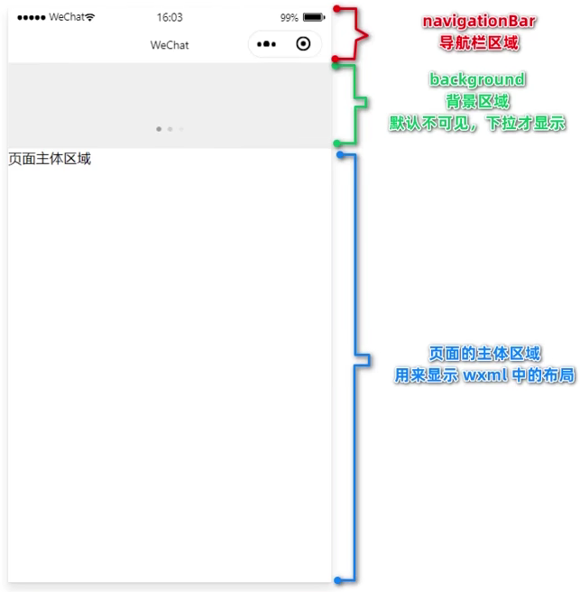
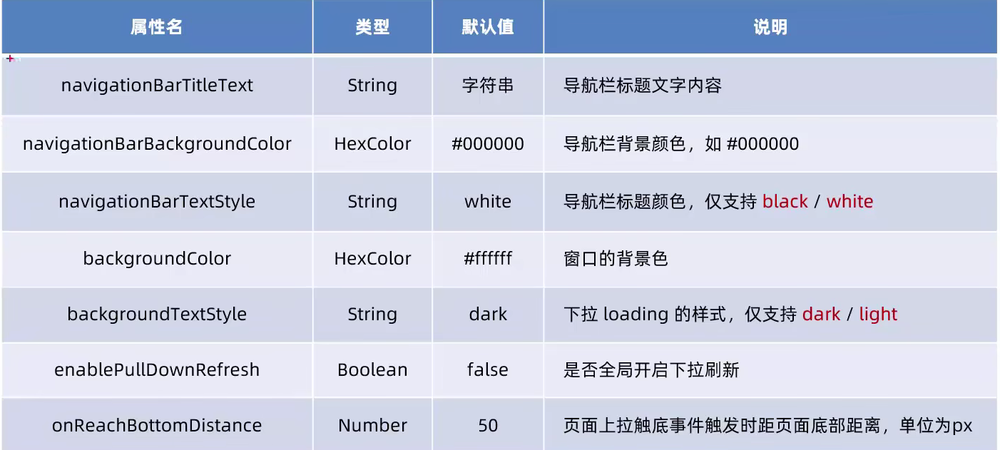
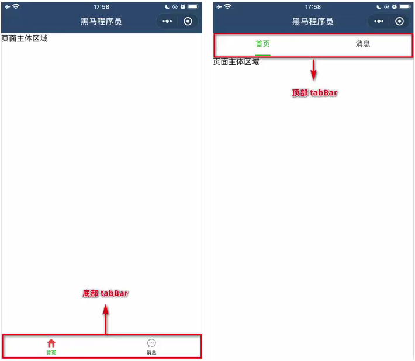
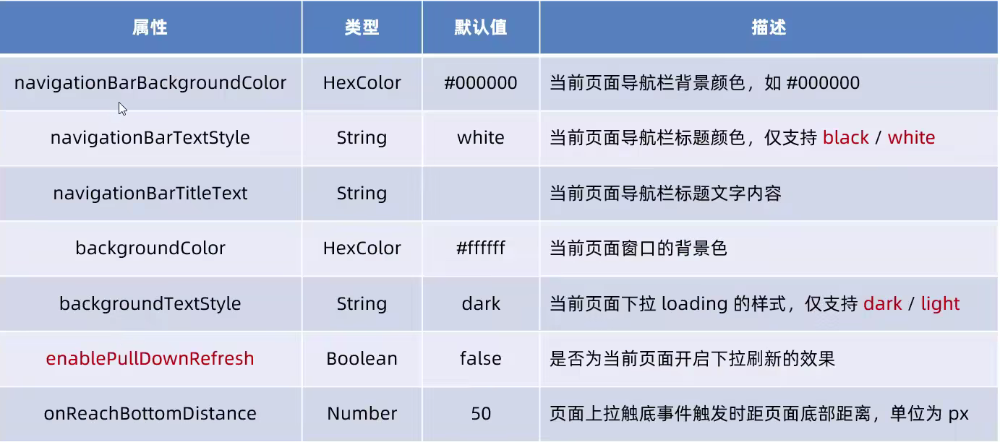

# 代码结构

app.json文件时当前小程序的全局配置

> 1. pages：用来记录当前小程序的所有页面路径。
> 2. windows：全局定义小程序所有页面的背景色、文字色等。
> 3. style： 全局定义小程序组件所使用的样式版本。
> 4. sitemapLocation：用来指明sitemap.json的位置。

project.config.json是项目配置文件,用来记录我们对小程序开发工具所做的个性化配置,例如:

> 1. setting中保存了编译相关的配置。
> 2. projectname 中保存的是项目名称。
> 3. appid中保存的是小程序的账号ID。

sitemap.json文件用来配置小程序页面是否允许微信索引。

> 当开发者允许微信索引时，微信会通过爬虫的形式，为小程序的页面内容建立索引。当用户的搜索关键字和页
> 面的索引匹配成功的时候，小程序的页面将可能展示在搜索结果中。
>
> ```json
>  "rules": [{
>   "action": "disallow",// 不被索引
>   "action": "allow",//默认索引	
>   "page": "*"
>   }]
> ```

页面的 .json 文件

小程序的每一个页面，可以使用 .json 文件对本页面的窗口外观进行配置，页面中的配置回覆盖app.json的window中的相同的配置

# 新增页面

app.json

```json
{
  "pages":[
    "pages/index/index",
    "pages/logs/logs",
    "pages/list/list" // 添加在page文件加里添加list
  ],
}
```

# wxml和html的区别

1. 标签名称不同
   - HTML:(div, span, img, a)
   - WXML:(view, text, image, navigtor)

2. 属性节点不同

- ```html
  <a href="#">超链接</a>
  ```

- ```html
  <navigator url="pages/home/home"></navigator>
  ```

3. 提供了类似与Vue的模板语法

- 数据绑定
- 列表渲染
- 条件渲染

# wxss和css的区别

1. 新增了rpx单位

- css中需要手动进行单位换算，例如rem
- wxss在底层支持的尺寸单位rpx，在不同大小的屏幕上小程序会自定进行换算

2. 提供了全局样式和局部样式

- 项目根目录中的app.wxss会作用域所有小程序页面
- 局部页面的.wxss样式仅对当前页面生效

3. wxss仅支持部分css选择器

-  .class和#id
- element
- 并集选择器、后代选择器
- ::after ::before等伪类选择器

# 小程序启动的过程

①把小程序的代码包下载到本地
②解析app.json全局配置文件
③执行app.js小程序入口文件，调用App()创建小程序实例
④渲染小程序首页
⑤小程序启动完成

# 页面渲染的过程

1. 加载解析页面的.json配置文件
2. 加载页面的.wxml模板和.WXSS样式
3. 执行页面的.js文件,调用Page()创建页面实例
4. 页面渲染完成页面渲染完成

# 小程序中组件的分类

小程序中的组件也是由宿主环境提供的，开发者可以基于组件快速搭建出漂亮的页面结构。官方把小程序的组件分为了九大类

|      描述      |                             组件                             |
| :------------: | :----------------------------------------------------------: |
| <br/>容器组件  | view：相当于div。<br>scroll-view：可滚动的视图区域，常用来实现列表滚动效果。<br/>swiper和swper-item：轮播图容器组件和 轮播图 item 组件 |
|    基础内容    | text：文本组件，类似于span标签<br>rich-text：富文本组件，支持吧HTML字符串渲染为WXML结构 |
|    表单组件    | [组件](https://developers.weixin.qq.com/miniprogram/dev/component/icon.html) |
|    导航组件    | [组件](https://developers.weixin.qq.com/miniprogram/dev/component/icon.html) |
|    媒体组件    | [组件](https://developers.weixin.qq.com/miniprogram/dev/component/icon.html) |
|  map地图组件   | [组件](https://developers.weixin.qq.com/miniprogram/dev/component/icon.html) |
| canvas画布组件 | [组件](https://developers.weixin.qq.com/miniprogram/dev/component/icon.html) |
|    开放功能    | [组件](https://developers.weixin.qq.com/miniprogram/dev/component/icon.html) |
|   无障碍访问   | [组件](https://developers.weixin.qq.com/miniprogram/dev/component/icon.html) |

```html
<!-- scroll-y="true" y轴滚动 -->
<!-- scroll-x="true" x轴滚动 -->
<!--需要添加宽高-->
<scroll-view  scroll-y="true">
      <view></view>
      <view></view>
      <view></view>
</scroll-view>

-------------------------------------------------------------------------------------------------------------------
<!-- indicator-dots="true" 显示面板指示点 -->
<!--indicator-color="red" 面板指示点颜色-->
<!--indicator-active-color+"red" 面板指示点选中颜色-->
<!--aytoplay="true" 是否自动切换-->
<!--intrval="5000" 自动切换时间间隔-->
<!--cirular="true" 是否采用衔接滑动-->
<swiper class="swiper_container">
  <swiper-item>
    <view class="item">A</view>
  </swiper-item>
  <swiper-item>
    <view  class="item">B</view>
  </swiper-item>
  <swiper-item>
    <view  class="item">C</view>
  </swiper-item>
</swiper>

-------------------------------------------------------------------------------------------------------------------
<view>
  手机号长按选中效果:
  <!-- user-select="true" 长按选中 -->
  <text user-select="true">123asdasd456789</text>
  <rich-text nodes="<h1 style='color:red;'>标题</h1>"/>
</view>

-------------------------------------------------------------------------------------------------------------------
button组件：可以通过open-type属性调用微信的各种功能（客服，转发，获取用户授权，获取用户信息）
navigator：页面导航组件；类似于HTML a标签
<view>--------------通过type属性指定按钮类型--------------</view>
<button>默认按钮</button>
<button type="primary">主色调按钮</button>
<button type="warn">警告</button>

<view>--------------通过size属性指定按钮大小--------------</view>
<button type="primary" size="mini" style="margin-left:140px">小尺寸按钮</button>

<view>--------------通过plain属性指定镂空按钮-------------</view>
<button type="primary" plain>镂空按钮</button>

-------------------------------------------------------------------------------------------------------------------
image组件：图片组件；，默认高度300px、高度240px
<image src="/" mode="scaleToFill"></image>
mode属性
<!--mode="scaleToFill"(默认值)缩放模式，不保持纵横比缩放图片，使图片的宽高完全拉伸至填满image元素-->
<!--mode="aspectFit"缩放模式，保持纵横比缩放图片，使图片的长边能完全显示出来。也就是说，可以完整地将图片显示出来。-->
<!--mode="aspectFix"缩放模式，保持纵横比缩放图片，只保证图片的短边能完全显示出来。也就是说，图片通常只在水平或垂直方向是完整的，另一个方向将会发生截取。-->
<!--mode="widthFix"缩放模式，宽不变，高度自动变化，保持原图宽高比不变-->
<!--mode="heightFix"缩放模式，高不变，宽度自动变化，保持原图宽高比-->
-------------------------------------------------------------------------------------------------------------------
```

# API

1. 事件监听API

- 以on开头

- 监听某些事件的触发。

2. 同步API

- 以Sync结尾

- 同步API的执行结果，可以通过函数返回值直接获取，如果执行出错会抛出异常。

3. 异步API

- 需要通过success、fall、complete接收调用

# 数据绑定

在打data中定义页面数据

```html
<view>{{msgLit[0].msg}}</view>

<script>
    Page({
	data: {
        // 字符串类型的数据
        info: 'info data',
        // 数组类型的数据
        msgLit: [{msg: 'hello'}, {mag: 'word'}]
    }
})
</script>
```

# 事件绑定

| 类型   | 绑定方式                | 事件描述                  |
| ------ | ----------------------- | ------------------------- |
| tap    | bindtap或bind:tap       | 手指点击后抬起，类似click |
| input  | bindinput或bind:input   | 文本框输入事件            |
| change | bindchange或binf:change | 状态改变时触发            |

**事件对象的属性列表**

|     属性      |  类型   |                     说明                     |
| :-----------: | :-----: | :------------------------------------------: |
|     type      | String  |                   事件类型                   |
|   timeStamp   | integer |       页面打开到触发事件所经过的毫秒数       |
|    target     | Object  |         触发事件的组件的一些属性集合         |
| currentTarget | Object  |              但前组件的属性集合              |
|    detail     | Object  |                  额外的信息                  |
|    touches    |  Array  | 触摸事件，当前停留在屏幕中的触摸点信息的数组 |
| changeTouches |  Array  |     触摸事件，当前变化的触摸点信息的数组     |

## data数据赋值

通过调用this.setData(dataObject)方法，可以给页面中的数据data数据进行重新赋值

```html
<view>
  {{num}}
</view>
<button bindtap="add">num++</button>
<script>
  data: {
    num:123
  },
  add() {
    this.setData({
      num: this.data.num+1
    })
  },
</script>
```

## 事件传参

为组件提供 data-参数名称="{{参数}}"

```html
<button bindtap="add" data-info="{{2}}">事件传参</button>
<！--info参数的名字————2传递的参数-->
 <script>
 add(event) {
     console.log(event.target.dataset.info)
 }
 </script>
```

## bindtinput的语法格式

```html
<input type="text"	 bindinput="getValue"  class="input"/>
<script>
  // 获取input的vlue
  getValue(e) {
    console.log(e.detail.value)
  },
</script>
```

# 条件渲染

## wx:if

使用wx:if拉判断是否需要渲染代码块

```html
<view wx:if="{{false}}"> 不渲染 </view>
<view wx:elif="{{false}}"> 不渲染 </view>
<view wx:else> 渲染 </view>
```

## block标签

```html
<!--如果一次性控制多个标签是否渲染 使用 block 标签包裹并在block上使用 wx:if-->
<!--block 不会被渲染-->
<block wx:if="{{false}}">
	<view>123</view>
    <view>123</view>
    <view>123</view>
</block>
```

## hidden

```html
<!---hidden 相当于 Vue的v-show控制display:none不过时为true时隐藏-->
<view hidden="{{flag}}"> 元素的显示与隐藏 </view>
```

# 列表渲染

## wx:for

通过wx:for对指定的数组渲染

```html
<script>
	data:{
	list:[1,2,3,4]
}
</script>
<view wx:for="{{list}}">
    <!--item当前值 index索引-->
 {{index}} {{item}}
</view>

<!--更改index和item的名字-->
<view wx:for="{{list}}" wx:for-index="i" wx:for-item="e">
 {{i}} {{e}}
</view>
```

## wx:key类似于Vue的key

```js
  data: {
    list:[
      {id:1,name:'a'},
      {id:2,name:'b'},
      {id:3,name:'c'}
    ]
  },
```

```html
<view wx:for="{{list}}" wx:key="item.id">
 {{item.id}} {{item.name}}
</view>
```

# wxcss

## rpx

rpx把屏幕分成了750份，就是屏幕总宽750rpx

## 样式引入

@import 后跟需要导入的外联样式表路径，用 ；结束

```css
/**
common.wxss
**/
.small-p{
    padding:5px
}


/**
app.wxss
**/
@import"./common.wxss";
.middle-p{
    padding:15px
}

/**
这样就可以使用公共样式的类名了
**/

<wxml>
	<view class="small-p"> 1 <view>
</wxml>
```

# 全局配置

**app.json**

## page:记录页面的存放路径

## window：窗口外观

   

   

```json
  "window":{
    "backgroundTextStyle":"dark",
    "navigationBarBackgroundColor": "#fff",
    "navigationBarTitleText": "小程序",
    "navigationBarTextStyle":"black"  ,
    "backgroundColor": "#373333",
    "enablePullDownRefresh": true,
    "onReachBottomDistance": 50
  },
```

## tabBar：设置小程序底部的tabBar样式



- tabBar中只能配置最少2个、最多5个tab页签
- 当渲染顶部tabBar时，不显示icon,只显示文本

|      属性       |              描述               |   类型   | 必填 | 默认值 |
| :-------------: | :-----------------------------: | :------: | :--: | :----: |
| backgroundColor |         tabBar 的背景色         | HexColor |  n   |        |
|   borderStyle   | 上边框的颜色，仅支持black/white |  String  |  n   | black  |
|  selectedColor  |    tab. 上的文字选中时的颜色    | HexColor |  n   |        |
|      color      |     文字的默认(未选中)颜色      | HexColor |  n   |        |
|     postion     | tabBar的位置，仅支持bottom/top  |  String  |  n   | bottom |
|      list       |     tab标签最少2个，最多5个     |  Array   |  y   |        |

**每个tab的配置项，就是list数组里的对象的配置**

|       属性       |                     描述                     | 必填 |  类型  |
| :--------------: | :------------------------------------------: | :--: | :----: |
| selectedlconPath | 选中时的图片路径，当postion为top时不显示icon |  n   | String |
|     iconPath     |              未选中时的图片路径              |  n   | String |
|       text       |               tab上显示的文字                |  y   | String |
|     pagePath     |     页面路径，页面必须在pages中预先定义      |  y   | String |

```json
"tabBar":{
    "list":[
      {
        "pagePath":"pages/list/list",
        "text":"list",
        "iconPath": "pages/icon/line_shopping (1).png",
        "selectedIconPath": "pages/icon/line_shopping.png"
     
      },
      {
        "pagePath":"pages/index/index",
        "text":"index",
        "iconPath": "pages/icon/line_home (1).png",
        "selectedIconPath": "pages/icon/line_home.png"
      }
    ],
    "color": "#ffff",
    "selectedColor": "#ffffff",
    "postion":"bottom",
    "borderStyle":"black",
    "backgroundColor": "#aeafad"
  },
```


## style:是否启用新版组件样式


# 页面配置

.json文件

当于全局配置冲突的时候以页面配置为准


